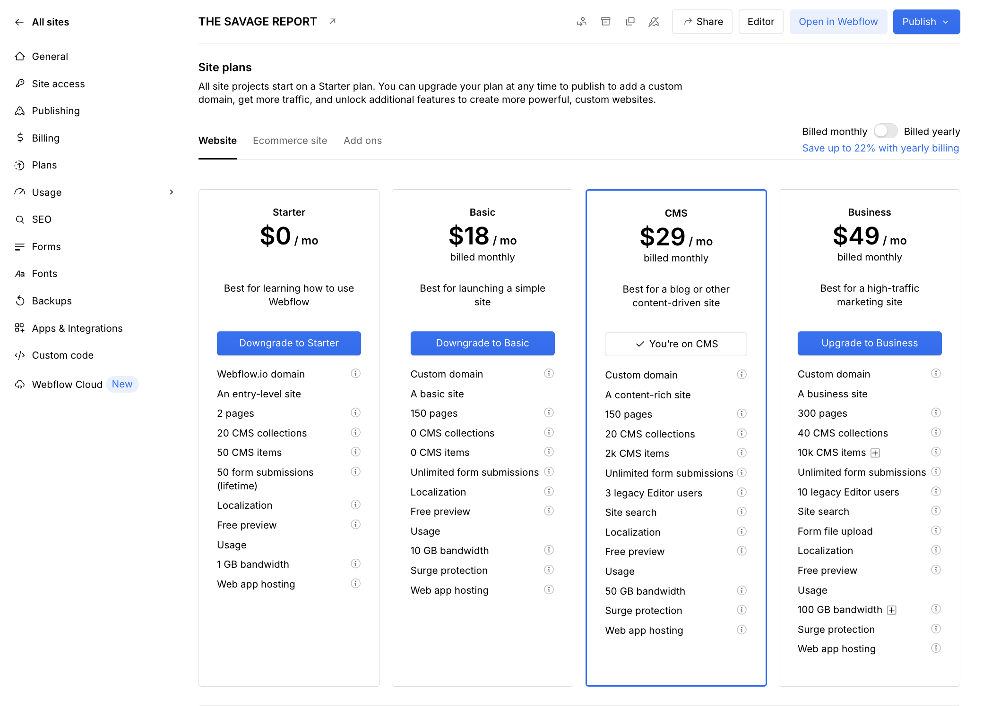
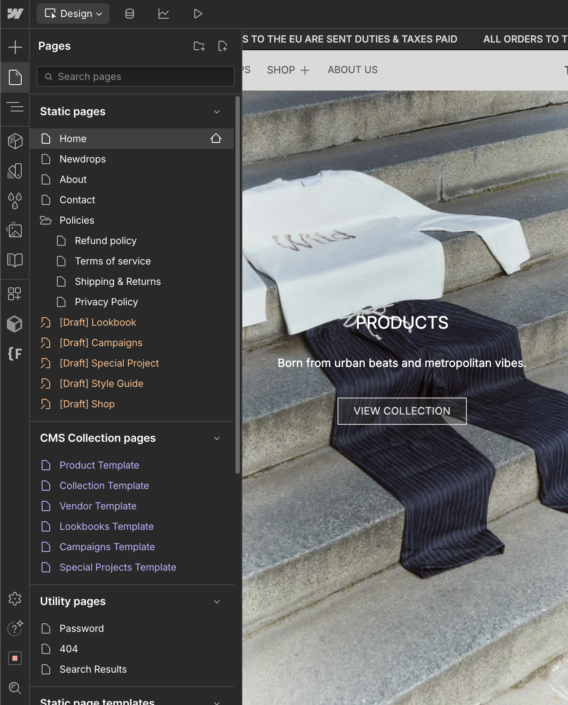
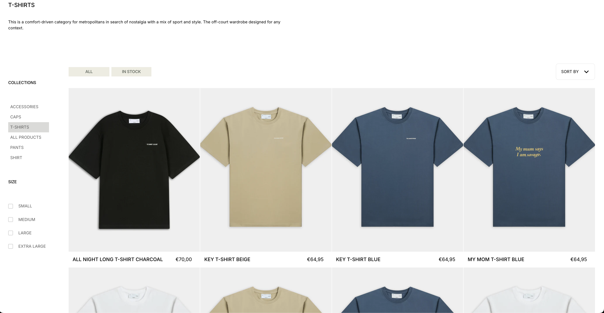
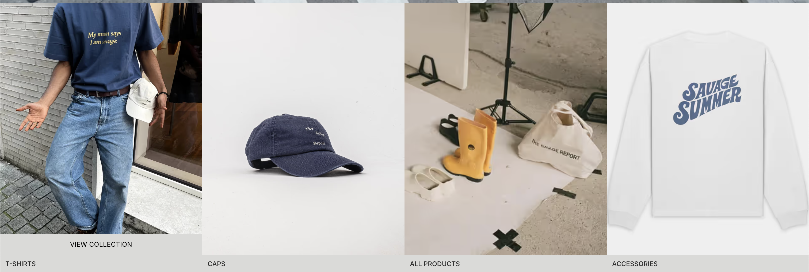
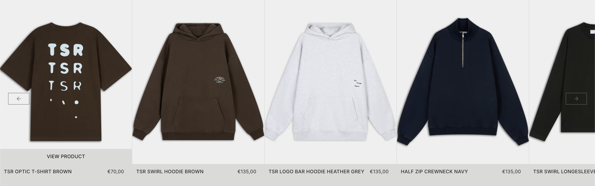
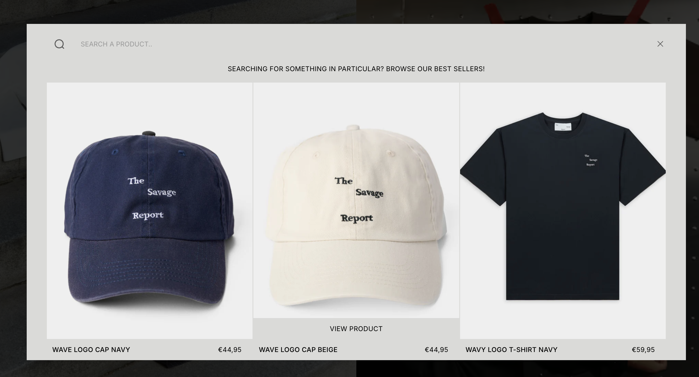
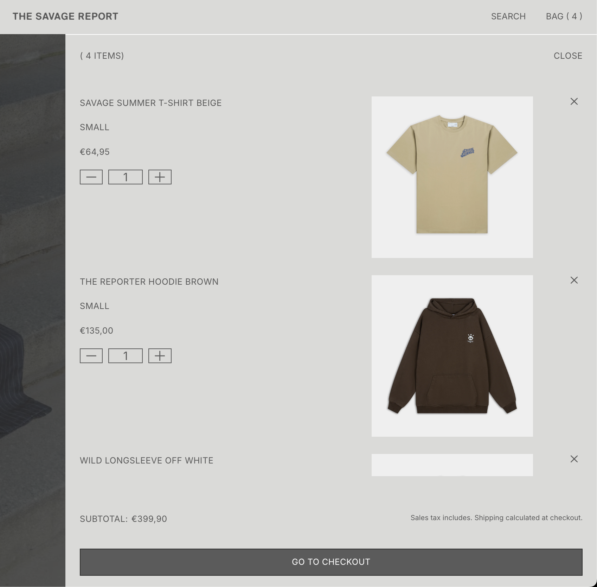
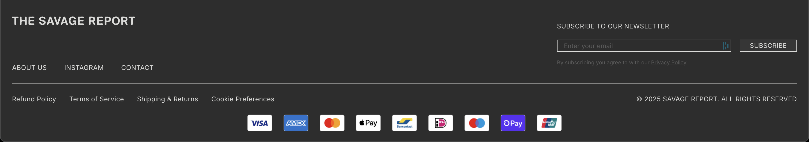
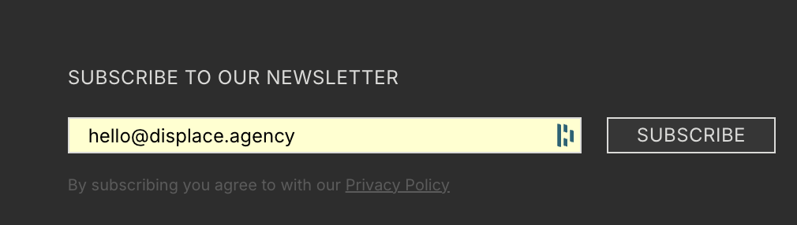
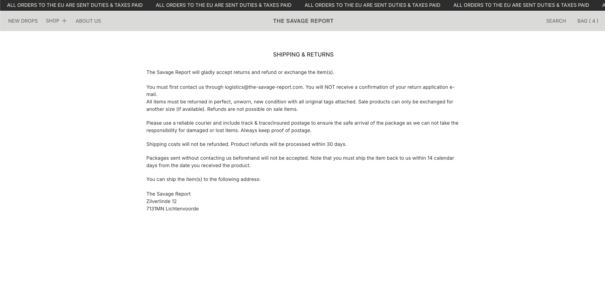

# Website Content & Static Pages - The Savage Report

## What This Is & Why It Matters
Your website, The Savage Report, is built with simplicity and flexibility in mind. This guide explains how your site is organized into 15 total pages, so you can understand the foundation and manage it confidently even without technical expertise.

## Website Structure Implementation Summary

| Item | What We Delivered | Priority | Date(s) | Status | Reference Link(s) |
|------|-------------------|----------|---------|--------|-------------------|
| Site Architecture | Complete website foundation with 15 pages | High | Jun 2025 | Active | <a href="https://webflow.com/dashboard/sites/savage-report-we" target="_blank" rel="noopener noreferrer">Webflow Dashboard</a> |
| CMS Collections | 6 collections with 46 products and 12 categories | High | Jun 2025 | Active | <a href="https://webflow.com/design/savage-report-we" target="_blank" rel="noopener noreferrer">CMS Collections</a> |
| Component Library | 12 reusable components for consistent design | Medium | Jun 2025 | Active | <a href="https://webflow.com/design/savage-report-we" target="_blank" rel="noopener noreferrer">Components Panel</a> |
| Navigation System | Intuitive menu structure with 5 main sections | High | Jun 2025 | Active | <a href="https://the-savage-report.com" target="_blank" rel="noopener noreferrer">Live Site Navigation</a> |

## What We Implemented

### **Site Architecture Foundation**
- **Site ID**: 683d50986bb12de3b5b4775f
- **Site Name**: THE SAVAGE REPORT
- **URL**: the-savage-report.com / www.the-savage-report.com
- **Created**: June 2, 2025
- **Last Published**: August 7, 2025
- **Localization**: Primary locale set to English (en)

### **Page Structure (15 Total Pages)**
- **Main Pages**: Home, About, Newdrops, Contact, Search Results
- **Policy Pages**: Privacy, Terms, Shipping & Returns, Refund Policy
- **Collection Pages**: Product, Collection, Vendor, Lookbooks, Campaigns, Special Projects
- **Draft Pages**: Shop, Lookbook, Campaigns, Special Project, Style Guide
- **System Pages**: 404 Error, 401 Password Protection

### **CMS Collections (6 Total)**
- **Product Collection**: 16 fields including pricing, SEO, and Shopify integration
- **Collection**: Product groupings and categories
- **Vendor**: Brand and manufacturer information
- **Lookbooks**: Visual content collections
- **Campaigns**: Marketing campaign content
- **Special Projects**: Limited edition and collaboration content

### **Components (12 Reusable Elements)**
- **Global Components**: Styles, navigation, footer, header, banner
- **Interactive Elements**: Product cards, collection grids, search functionality
- **Content Blocks**: Newsletter signup, cookie banner, load more functionality

## Results & Impact

### **Operational Efficiency**
- **46 products** managed through integrated CMS
- **12 collections** for organized product categorization
- **8 vendors** with dedicated brand pages
- **15 total pages** with consistent design and functionality

### **User Experience Benefits**
- **Intuitive navigation** with 5 main sections
- **Consistent design** across all pages using 12 reusable components
- **Fast search functionality** for quick product discovery
- **Mobile-responsive** design for all devices

### **Business Management**
- **Centralized content control** through Webflow CMS
- **Real-time updates** without technical knowledge
- **Scalable structure** for future growth and expansion

## Website Structure Visual Guide

### **Homepage Hero Section**
The main landing page showcases your brand with a prominent hero banner and navigation.

- **Purpose**: Main landing page with brand messaging and navigation
- **Location**: [Webflow Designer](https://webflow.com/design/savage-report-we) · [Live Site](https://the-savage-report.com)
- **Features**: Hero banner, main navigation, featured content sections

### **Webflow Designer Page Structure**
All 15 pages are organized in the Webflow designer for easy management and updates.

- **Purpose**: Central hub for managing all website pages and content
- **Location**: [Webflow Designer](https://webflow.com/design/savage-report-we)
- **Organization**: Pages grouped by function (Main, Policy, Collection, Draft, System)

### **Shop & Collections Structure**
Product pages and collections are organized for optimal user experience and management.

- **Purpose**: Product discovery and category browsing
- **Location**: [Shop Page](https://webflow.com/design/savage-report-we) · [Live Collections](https://the-savage-report.com)
- **Features**: Product grids, category filters, collection navigation

### **Collection Carousel Display**
Collections are displayed in engaging carousel format for better user engagement.

- **Purpose**: Showcase multiple collections in engaging format
- **Location**: [Collection Pages](https://webflow.com/design/savage-report-we)
- **Features**: Horizontal scrolling, visual thumbnails, quick navigation

### **Product Carousel Display**
Individual products are displayed in carousel format for detailed viewing.

- **Purpose**: Detailed product viewing and comparison
- **Location**: [Product Pages](https://webflow.com/design/savage-report-we)
- **Features**: Multiple product images, zoom functionality, related products

### **Search Functionality**
Advanced search system helps users find products quickly and efficiently.

- **Purpose**: Quick product discovery and filtering
- **Location**: [Search Page](https://webflow.com/design/savage-report-we) · [Live Search](https://the-savage-report.com/search)
- **Features**: Real-time search, filters, search suggestions

### **Shopping Cart Integration**
Seamless add-to-cart functionality integrated with Shopify for e-commerce operations.

- **Purpose**: Product purchase and cart management
- **Location**: [Product Pages](https://webflow.com/design/savage-report-we) · [Shopify Integration](https://webflow.com/dashboard/sites/savage-report-we)
- **Features**: One-click add to cart, cart preview, checkout integration

### **Footer & Newsletter**
Site footer with newsletter subscription for customer engagement and retention.

- **Purpose**: Site navigation and customer engagement
- **Location**: [Footer Component](https://webflow.com/design/savage-report-we)
- **Features**: Navigation links, social media, contact information

### **Newsletter Subscription**
Integrated newsletter signup for customer communication and marketing.

- **Purpose**: Customer email collection and marketing communication
- **Location**: [Newsletter Component](https://webflow.com/design/savage-report-we)
- **Features**: Email validation, subscription management, marketing integration

### **Policy Pages Structure**
Essential legal and policy pages for business compliance and customer trust.

- **Purpose**: Business compliance and customer information
- **Location**: [Policy Pages](https://webflow.com/design/savage-report-we) · [Live Policies](https://the-savage-report.com/policies)
- **Features**: Legal compliance, customer information, business policies

## Useful Links

### Webflow Management
- Webflow Dashboard: [Site Management](https://webflow.com/dashboard/sites/savage-report-we)
- Webflow Designer: [Editing & CMS](https://webflow.com/design/savage-report-we)
- Webflow Settings: [General Configuration](https://webflow.com/dashboard/sites/savage-report-we/general)

### Live Site Verification
- Live Site: [Homepage](https://www.the-savage-report.com)
- Live Search: [Test Search Features](https://www.the-savage-report.com/search)
- Live Policies: [Legal Pages](https://www.the-savage-report.com/policies)

### Related Documentation
- CMS Collections: [Overview](./04-cms-collections.md)
- Page Speed Optimization: [Performance Metrics](./06-page-speed-optimization.md)

### Knowledge Hub Resources
- Performance: [Page Speed Optimization Guide](../knowledge-hub/performance/page-speed-optimization-guide.md)
- SEO: [XML Sitemap Management](../knowledge-hub/seo/xml-sitemap-management.md)
- SEO: [Schema Markup for E-commerce](../knowledge-hub/seo/schema-markup-for-ecommerce.md)