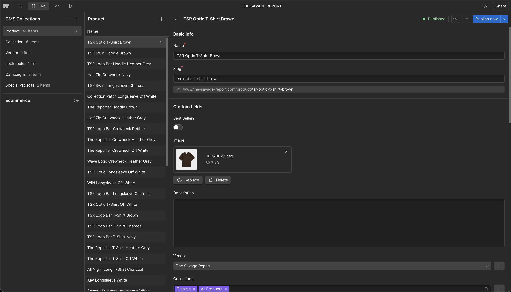
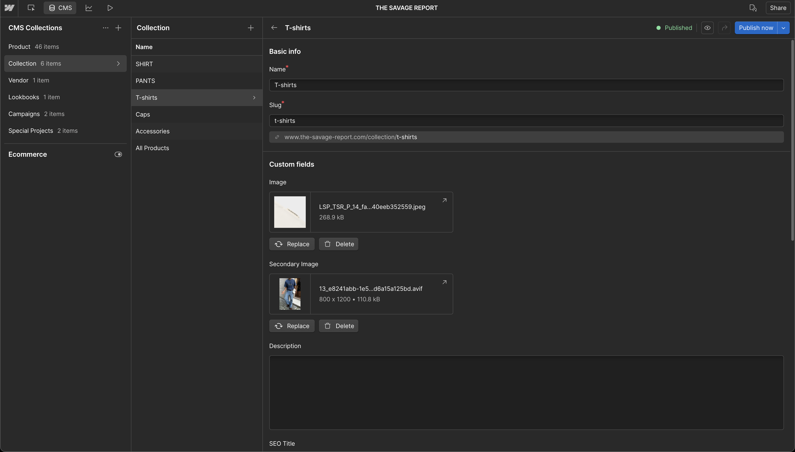
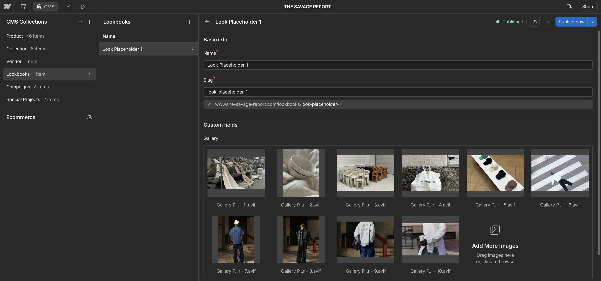
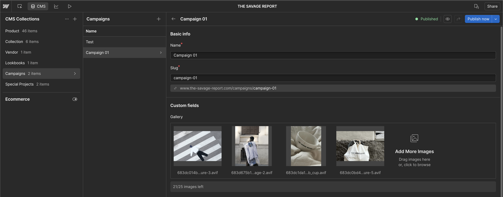
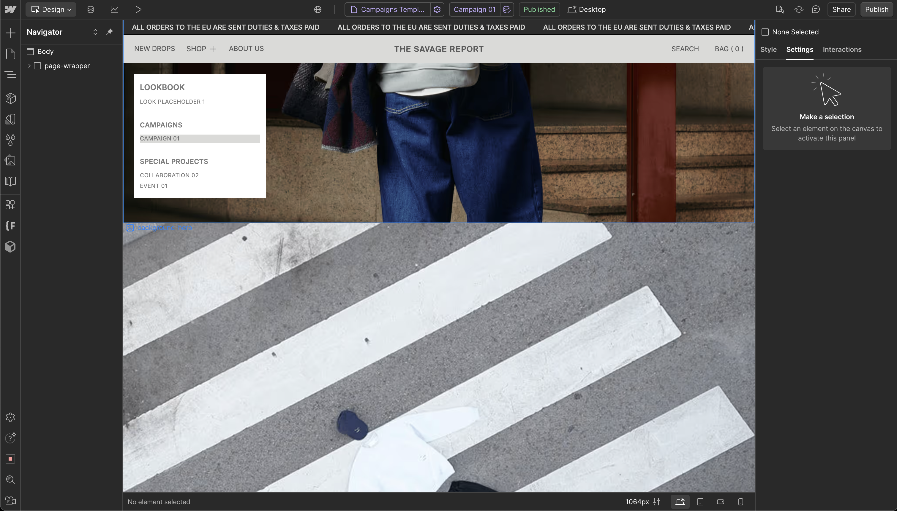
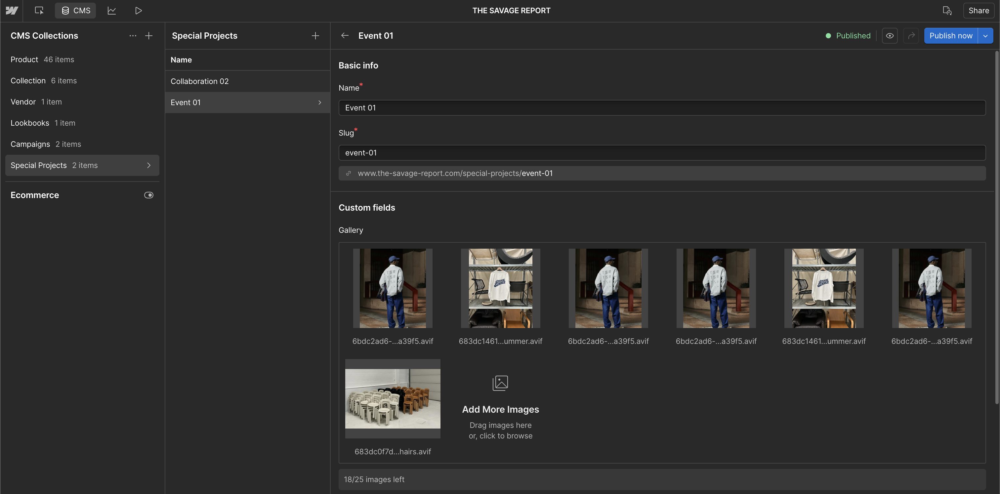
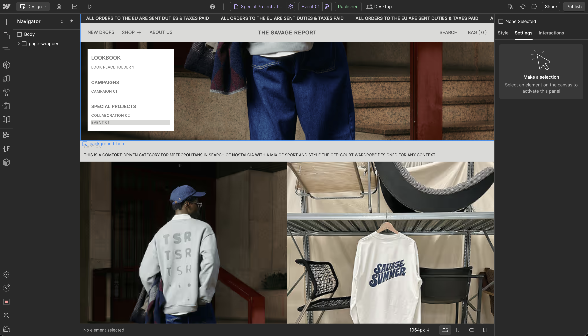

# CMS Collections - The Savage Report

## What This Is & Why It Matters
This article documents the six CMS collections powering The Savage Report. It explains what each collection does, how content flows from Shopify to Webflow, and the business value of a clean, scalable content model.

## Collections Implementation Summary

| Item | What We Delivered | Impact | Status | Reference Link(s) |
|------|-------------------|--------|--------|-------------------|
| [Products](#products) | 46 product pages synced from Shopify via Smootify; custom secondary image field for merchandising | High | ✅ Active | <a href="https://webflow.com/dashboard/sites/savage-report-we/cms/collections/products" target="_blank" rel="noopener noreferrer">Webflow → Products</a> |
| [Collections](#collections) | Category grouping synced from Shopify; clean slugs and descriptions | High | ✅ Active | <a href="https://webflow.com/dashboard/sites/savage-report-we/cms/collections/collections" target="_blank" rel="noopener noreferrer">Webflow → Collections</a> |
| [Vendors](#vendors) | Brand profiles synced from Shopify (currently one vendor) | Medium | ✅ Active | <a href="https://webflow.com/dashboard/sites/savage-report-we/cms" target="_blank" rel="noopener noreferrer">Webflow CMS</a> |
| [Lookbooks](#lookbooks) | Visual editorials with gallery field and optional product linking | Medium | ✅ Active | <a href="https://webflow.com/dashboard/sites/savage-report-we/cms" target="_blank" rel="noopener noreferrer">Webflow CMS</a> |
| [Campaigns](#campaigns) | Time-bound collections with start/end dates and hero creative | Medium | ✅ Active | <a href="https://webflow.com/dashboard/sites/savage-report-we/cms" target="_blank" rel="noopener noreferrer">Webflow CMS</a> |
| [Special Projects](#special-projects) | Limited releases/collaborations with dedicated templates | Medium | ✅ Active | <a href="https://webflow.com/dashboard/sites/savage-report-we/cms" target="_blank" rel="noopener noreferrer">Webflow CMS</a> |

> See also: [Smootify Integration Guide](../knowledge-hub/ecommerce/smootify-webflow-integration-guide.md)

## Products
- Synced from Shopify via Smootify; core data (title, price, inventory, variants) is read-only in Webflow
- Custom image fields enabled for merchandising (e.g., secondary card image for carousels)
- Product template renders content consistently with SEO fields available per item

- **Purpose**: Single source of truth for product content with Webflow display control
- **Location**: <a href="https://webflow.com/dashboard/sites/savage-report-we/cms/collections/products" target="_blank" rel="noopener noreferrer">Webflow → Products</a>

## Collections
- Synced taxonomy from Shopify organizes products (e.g., T-Shirts, Hats)
- Clean slugs and descriptions for user-friendly navigation and SEO
- Optional image field for richer collection landing pages

- **Purpose**: Category pages that group products and improve discovery
- **Location**: <a href="https://webflow.com/dashboard/sites/savage-report-we/cms/collections/collections" target="_blank" rel="noopener noreferrer">Webflow → Collections</a>

## Vendors
- Synced from Shopify; reflects brand/manufacturer information
- Currently one vendor (The Savage Report), so edits are infrequent
- Template ready for future multi-brand expansion

- **Purpose**: Brand context and filtering where applicable
- **Location**: <a href="https://webflow.com/dashboard/sites/savage-report-we/cms" target="_blank" rel="noopener noreferrer">Webflow CMS</a>

## Lookbooks
- Editorial galleries with hero + multi-image fields; optional product tagging
- Designed for storytelling and seasonal inspiration
- Auto-rendered via the Lookbook template; SEO fields per item

- **Purpose**: Publish visual narratives that link to featured products
- **Location**: <a href="https://webflow.com/dashboard/sites/savage-report-we/cms" target="_blank" rel="noopener noreferrer">Webflow CMS</a>

## Campaigns
- Time-bound launches with start/end dates and hero creative
- Ideal for seasonal drops or promotional moments
- Template-driven pages keep design consistent

- **Purpose**: Coordinate marketing pushes with clear timelines
- **Location**: <a href="https://webflow.com/dashboard/sites/savage-report-we/cms" target="_blank" rel="noopener noreferrer">Webflow CMS</a>

## Special Projects
- One-off collaborations, limited releases, and cultural features
- Dedicated template for brand storytelling beyond standard products
- Simple fields for fast publishing (title, hero, release date)

- **Purpose**: Spotlight unique initiatives with their own narrative
- **Location**: <a href="https://webflow.com/dashboard/sites/savage-report-we/cms" target="_blank" rel="noopener noreferrer">Webflow CMS</a>

## Results & Impact
- **Operational efficiency**: Update products once in Shopify; Webflow displays instantly
- **Consistent quality**: Templates ensure professional, on-brand pages
- **Faster launches**: Lookbooks, campaigns, and projects publish in minutes
- **SEO readiness**: Clean slugs, meta fields, and cross-linking across items

## Useful Links

### Implementation
- Webflow CMS: [Management](https://webflow.com/dashboard/sites/savage-report-we/cms)
- Webflow CMS: [Products Collection](https://webflow.com/dashboard/sites/savage-report-we/cms/collections/products)
- Webflow CMS: [Collections](https://webflow.com/dashboard/sites/savage-report-we/cms/collections/collections)

### Admin Access
- Shopify Admin: [Store Management](https://admin.shopify.com/store/thesavagereport)
- Webflow Designer: [Editing & CMS](https://webflow.com/design/savage-report-we)
- Live Site: [Homepage](https://www.the-savage-report.com)

### Related Documentation
- Smootify Integration: [Guide](../knowledge-hub/ecommerce/smootify-webflow-integration-guide.md)
- Page Speed Optimization: [Performance](./06-page-speed-optimization.md)

---
*Last Updated: August 2025*  
*Document Version: 2.0*  
*Maintained by: Displace Agency*

