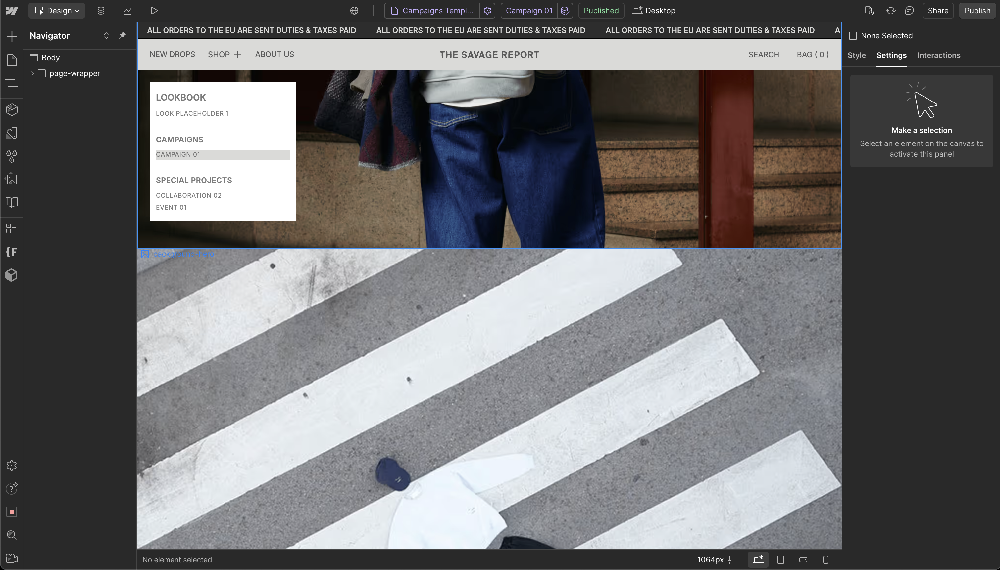
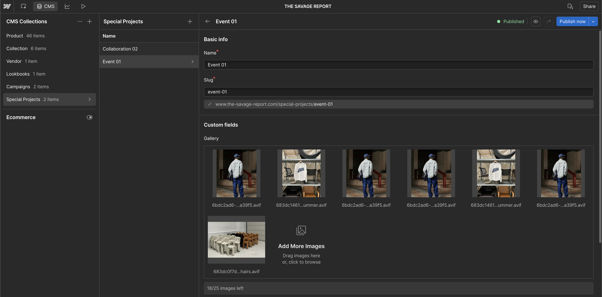

# CMS Structure & Content Management - The Savage Report

## What This Is & Why It Matters
This article documents the CMS foundations of The Savage Report. It explains each collection's purpose, the key fields you will use, and how the system splits between two sources of truth:

- Webflow-managed collections for publishing new editorial content: Lookbooks, Campaigns, Special Projects
- Shopify-managed collections synchronized via Smootify: Products, Collections, Vendors (auto-updated; minimal manual editing)

## CMS Implementation Summary

| Item | What We Delivered | Priority | Status | Reference Link(s) |
|------|-------------------|----------|--------|-------------------|
| [Products Collection](#products-collection) | 46 product pages with Shopify ID linking | High | ✅ Active | <a href="https://webflow.com/dashboard/sites/savage-report-we/cms/collections/products" target="_blank" rel="noopener noreferrer">Products Collection</a> |
| [Collections Collection](#collections-collection) | Category grouping for products (synced) | High | ✅ Active | <a href="https://webflow.com/dashboard/sites/savage-report-we/cms/collections/collections" target="_blank" rel="noopener noreferrer">Collections Management</a> |
| [Vendors Collection](#vendors-collection) | 8 brand profiles with logos and descriptions | Medium | ✅ Active | <a href="https://webflow.com/dashboard/sites/savage-report-we/cms" target="_blank" rel="noopener noreferrer">Webflow CMS</a> |
| [Lookbooks Collection](#lookbooks-collection) | Visual guides with product linkage | Medium | ✅ Active | <a href="https://webflow.com/dashboard/sites/savage-report-we/cms" target="_blank" rel="noopener noreferrer">Webflow CMS</a> |
| [Campaigns Collection](#campaigns-collection) | Time-based initiatives with scheduling | Medium | ✅ Active | <a href="https://webflow.com/dashboard/sites/savage-report-we/cms" target="_blank" rel="noopener noreferrer">Webflow CMS</a> |
| [Special Projects Collection](#special-projects-collection) | Limited releases and collaborations | Medium | ✅ Active | <a href="https://webflow.com/dashboard/sites/savage-report-we/cms" target="_blank" rel="noopener noreferrer">Webflow CMS</a> |

<a id="collections-collection"></a>
## Collections Collection
Synced from Shopify via Smootify. Groups products into categories for the shop.

Fields (synced unless noted):
- Name, Slug (synced)
- Shopify ID (synced)
- Description (synced)
- Image (custom, optional for internal display)

<a id="products-collection"></a>
## Products Collection
Synced from Shopify via Smootify. Do not edit core product data in Webflow.

Fields:
- Shopify ID, Name, Slug, Price, Inventory (synced)
- Image, Secondary Image (custom – used for homepage/carousels; editable in Webflow)

Links: <a href="https://webflow.com/dashboard/sites/savage-report-we/cms/collections/products" target="_blank" rel="noopener noreferrer">Manage Products</a> · [Smootify Integration Guide](../knowledge-hub/ecommerce/smootify-webflow-integration-guide.md)

<a id="updating-static-collections"></a>
## Updating Static Collections
For Lookbooks, Campaigns, and Special Projects (managed in Webflow):

1. Open Webflow CMS → select the collection
2. Click “New” or choose an existing item
3. Fill in Title, Slug, Description
4. Upload Hero Image; for Lookbooks also upload multiple images to the Gallery field
5. Publish — pages render immediately using the template

<a id="vendors-collection"></a>
## Vendors Collection
Synced from Shopify. Note: currently only one vendor (The Savage Report), so edits are uncommon.

<a id="lookbooks-collection"></a>
## Lookbooks Collection
Purpose: Publish inspirational visual content with optional product links. Upload multiple images to the Gallery field; pages render automatically via the template.

Fields:
- Title, Slug, Description
- Hero Image
- Gallery (multi-image)

Screenshots:


<a id="campaigns-collection"></a>
## Campaigns Collection
Purpose: Promote seasonal or limited initiatives.

Fields:
- Title, Slug, Description
- Hero Image
- Start Date, End Date

Screenshots:



<a id="special-projects-collection"></a>
## Special Projects Collection
Purpose: Limited edition releases and cultural collaborations (one-off drops).

Fields:
- Title, Slug, Description
- Hero Image
- Release Date

Screenshot:


<a id="seo-integration-system"></a>
## SEO Integration System
- Meta titles and descriptions for every CMS item
- Structured data markup for rich search results
- Automatic URL generation and optimization
- Cross-linking between related content

## How the System Works

### Data Flow Architecture
```
Shopify (Product Data) → Smootify (Integration Layer) → Webflow (Page Display)
```

### Key Integration Points
- **Shopify ID Field**: Links each Webflow page to live Shopify data
- **Real-time Updates**: Product changes in Shopify appear instantly on website
- **Automatic Sync**: No manual updates needed for product information
- **Design Consistency**: Webflow templates ensure uniform appearance

<a id="content-management-workflow"></a>
## Content Management Workflow

### Daily Operations (Shopify)
- Product pricing and inventory updates
- New product additions and descriptions
- Image uploads and variant management
- Order processing and customer management

### Occasional Updates (Webflow)
- New collection page creation
- Lookbook and campaign launches
- SEO optimization and meta updates
- Homepage feature management

### Automatic Processes
- Product data synchronization
- URL generation and optimization
- Image optimization and delivery
- Performance monitoring and caching

<a id="cms-field-structure"></a>
## CMS Field Structure

### Critical Fields (All Collections)
| Field | Purpose | Update Frequency |
|-------|---------|------------------|
| **Name** | Content title and display name | As needed |
| **Slug** | URL generation (auto-created) | Automatic |
| **SEO Title** | Google search result title | Marketing updates |
| **SEO Description** | Google search result snippet | Marketing updates |
| **Status** | Published/Draft/Archived | Content lifecycle |

### Product-Specific Fields
| Field | Purpose | Data Source |
|-------|---------|-------------|
| **Shopify ID** | Live data connection | Shopify sync |
| **Collection** | Product categorization | Shopify data |
| **Vendor** | Brand association | Shopify data |
| **Price** | Current selling price | Shopify live |
| **Inventory** | Stock availability | Shopify live |

### Collection-Specific Fields
| Field | Purpose | Business Value |
|-------|---------|----------------|
| **Hero Image** | Visual impact | Brand storytelling |
| **Description** | Collection story | Customer engagement |
| **Order** | Display sequence | Strategic placement |
| **Featured** | Homepage visibility | Conversion focus |

<a id="performance-optimizations"></a>
## Performance Optimizations

### Image Management
- **Automatic Optimization**: All images compressed to optimal sizes
- **Responsive Versions**: Mobile (300px), tablet (600px), desktop (1200px)
- **WebP Format**: 30% smaller than JPEG with same quality
- **Lazy Loading**: Images load only when needed

### Content Delivery
- **CDN Integration**: Fastly network for global performance
- **Browser Caching**: 60% faster loads for returning visitors
- **Smart Prefetching**: Next page loads on hover
- **Code Minification**: Optimized HTML/CSS/JS delivery

<a id="business-impact"></a>
## Business Impact

### Operational Efficiency
- **Single Source of Truth**: Update products once in Shopify
- **Automatic Synchronization**: No duplicate data entry
- **Real-time Accuracy**: Customers always see current information
- **Scalable Growth**: Add unlimited products without performance loss

### Customer Experience
- **Instant Updates**: Price and inventory changes appear immediately
- **Consistent Design**: Every product page looks professional
- **Fast Loading**: Optimized content delivery for better engagement
- **Mobile Optimized**: Responsive design for all devices

### SEO Benefits
- **Structured Data**: Rich search results with product information
- **Fast Loading**: Better Google rankings through performance
- **Content Organization**: Clear site structure for search engines
- **Meta Optimization**: Optimized titles and descriptions

## Useful Links

### Implementation
- Webflow CMS: <a href="https://webflow.com/dashboard/sites/savage-report-we/cms" target="_blank" rel="noopener noreferrer">Content Management</a>
- Products Collection: <a href="https://webflow.com/dashboard/sites/savage-report-we/cms/collections/products" target="_blank" rel="noopener noreferrer">Product Management</a>
- Collections Management: <a href="https://webflow.com/dashboard/sites/savage-report-we/cms/collections/collections" target="_blank" rel="noopener noreferrer">Collection Organization</a>

### Admin Access
- Shopify Admin: <a href="https://the-savage-report.myshopify.com/admin" target="_blank" rel="noopener noreferrer">Store Management</a>
- Webflow Designer: <a href="https://webflow.com/design/savage-report-we" target="_blank" rel="noopener noreferrer">Design & Layout</a>
- Live Website: <a href="https://the-savage-report.com" target="_blank" rel="noopener noreferrer">Customer View</a>

### Related Documentation
- CMS Collections: [docs/05-seo-implementation.md](./05-seo-implementation.md)
- Page Speed Optimization: [docs/06-page-speed-optimization.md](./06-page-speed-optimization.md)
- Technical Architecture: [docs/02-technical-architecture.md](./02-technical-architecture.md)
- Analytics Implementation: [docs/07-analytics-implementation.md](./07-analytics-implementation.md)

---
*Document Version: 3.0*  
*Last Updated: August 8, 2025*  
*Maintained by: Displace Agency*
