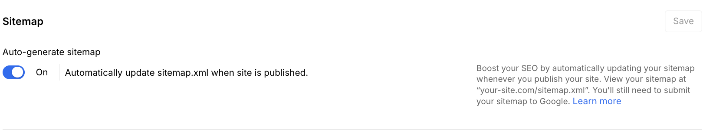
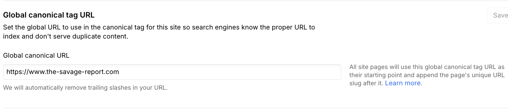
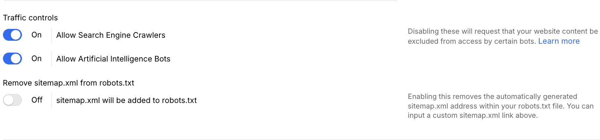

# SEO Implementation & Strategy - The Savage Report

## What This Is & Why It Matters
We implemented foundational SEO across The Savage Report to help search engines understand the site quickly, index the right pages, and present high-quality results that drive traffic and sales.

## SEO Implementation Summary

| Item | What We Delivered | Impact | Status | Reference Link(s) |
|------|-------------------|--------|--------|-------------------|
| [Structured Data (Schema Markup)](#structured-data-schema-markup) | JSON-LD for Product, Organization, Local Business, and Website | High | ✅ Active | [Schema Markup Doc](./05.1-seo-schema.md) |
| [SEO-Optimized Content & Metadata](#seo-optimized-content--metadata) | Brand-consistent titles, descriptions, Open Graph tags, optimized URL slugs | High | ✅ Active | <a href="https://webflow.com/dashboard/sites/savage-report-we/designer" target="_blank" rel="noopener noreferrer">Webflow Designer</a> |

| [Robots.txt Configuration](#robots-txt-configuration) | Dual setup: Webflow main site + Shopify subdomain for optimal crawling | High | ✅ Active | <a href="https://the-savage-report.com/robots.txt" target="_blank" rel="noopener noreferrer">Webflow robots.txt</a> · <a href="https://shop.the-savage-report.com/robots.txt" target="_blank" rel="noopener noreferrer">Shopify robots.txt</a> |
| [XML Sitemap Implementation](#xml-sitemap-implementation) | Auto-generated sitemap with 61 URLs, verified in Google Search Console | High | ✅ Active | <a href="https://the-savage-report.com/sitemap.xml" target="_blank" rel="noopener noreferrer">Sitemap</a> · <a href="https://search.google.com/search-console/sitemaps?resource_id=sc-domain:the-savage-report.com" target="_blank" rel="noopener noreferrer">GSC Sitemaps</a> |
| [Webflow SEO Settings](#webflow-seo-settings) | Canonical URLs and traffic controls for search engine crawlers and AI bots | Medium | ✅ Active | <a href="https://webflow.com/dashboard/sites/savage-report-we/seo" target="_blank" rel="noopener noreferrer">Webflow SEO Settings</a> |

> See also: 📚 [XML Sitemap Management](../knowledge-hub/seo/xml-sitemap-management.md)

## Structured Data (Schema Markup)
- Prepared JSON-LD for Product, Organization, Local Business, and Website
- Currently inactive to avoid conflicts with the performance optimizer; ready to enable after compatibility validation
- Goal: enable rich results (stars, price, brand info) without compromising speed

## SEO-Optimized Content & Metadata
- Added SEO text blocks on collection pages (human-first, keyword-informed)
- Implemented consistent, brand-first meta titles and optimized descriptions
- Added Open Graph tags for improved social sharing
- Standardized URL slugs using best practices

## Robots.txt Configuration

### Dual Setup Overview
We have two separate robots.txt files that work independently:

1. **Webflow Main Site** (`the-savage-report.com/robots.txt`) - Controls crawling for your main website content
2. **Shopify Subdomain** (`shop.the-savage-report.com/robots.txt`) - Controls crawling for checkout/cart pages (auto-generated by Shopify)

### Webflow Robots.txt (Main Site)
This is the primary robots.txt that controls crawling for your main website content, products, and collections.

```txt
# THE SAVAGE REPORT - Robots.txt
# Website: https://the-savage-report.com
# Last Updated: August 2025

# Main crawler directives
User-agent: *
Allow: /

# Core pages - explicitly allow
Allow: /about
Allow: /contact
Allow: /newdrops
Allow: /policies/
Allow: /policies/privacy-policy
Allow: /policies/terms-of-service
Allow: /policies/refund-policy
Allow: /policies/shipping-returns

# Collections - allow indexing
Allow: /product/
Allow: /collection/
Allow: /vendor/
Allow: /lookbooks/
Allow: /campaigns/
Allow: /special-projects/

# Prevent duplicate content from filters/sorting
Disallow: /*?*sort=
Disallow: /*?*filter=
Disallow: /*?*page=
Disallow: /*?*size=
Disallow: /*?*color=
Disallow: /*?*price=
Disallow: /*?*view=
Disallow: /search?

# Block utility pages
Disallow: /401
Disallow: /style-guide

# Block draft/unpublished pages
Disallow: /shop
Disallow: /lookbook
Disallow: /special-project

# Googlebot-specific (for better crawl budget)
User-agent: Googlebot
Allow: /
Crawl-delay: 0

# Aggressive bot management
User-agent: AhrefsBot
Crawl-delay: 10

User-agent: SemrushBot
Crawl-delay: 10

User-agent: DotBot
Crawl-delay: 10

User-agent: MJ12bot
Crawl-delay: 15

# Block unwanted bots
User-agent: PetalBot
Disallow: /

User-agent: AspiegelBot
Disallow: /

User-agent: DataForSeoBot
Disallow: /

# Sitemap locations
Sitemap: https://the-savage-report.com/sitemap.xml
```

### Shopify Robots.txt (Subdomain)
Shopify automatically generates a robots.txt for your subdomain. It's optimized for e-commerce and includes:
- Allow crawling of product pages and collections
- Block admin areas and checkout pages
- Include sitemap reference

### Why This Dual Setup Works
- **Main site control**: Webflow robots.txt gives you full control over main site crawling
- **E-commerce optimization**: Shopify's auto-generated robots.txt is optimized for product discovery
- **No conflicts**: Each robots.txt only controls its respective domain
- **SEO benefits**: Both are configured for optimal search engine crawling

### Verification & Testing
- **Webflow robots.txt**: Verified in [Google Search Console](https://search.google.com/search-console/settings/robots-txt?resource_id=sc-domain:the-savage-report.com)
- **Shopify robots.txt**: Automatically managed by Shopify
- **Both working**: Search engines can access both sites without conflicts

## XML Sitemap Implementation

### Sitemap Summary
- **Total URLs**: 61
- **Static Pages**: 8 (Home, About, Contact, Newdrops, Policies)
- **Collection Pages**: 6 (Accessories, All Products, Hats, Pants, Shirts, T-Shirts)
- **Product Pages**: 46 individual products
- **Auto-generated**: Yes, by Webflow CMS
- **Last Updated**: Automatically updated when content changes

### Sitemap Management
- **Location**: https://www.the-savage-report.com/sitemap.xml
- **Google Search Console**: Verified and indexed
- **Auto-updates**: New products and collections automatically added
- **SEO Impact**: Helps search engines discover and index all content efficiently

### Sitemap Configuration
Configure automatic sitemap generation when site is published for better search engine indexing.



- **Purpose**: Configure automatic sitemap generation when site is published
- **Location**: [Webflow → SEO Settings](https://webflow.com/dashboard/sites/savage-report-we/seo)

### Google Search Console Integration
This is where you can review and manage sitemap status over time (status, last read, discovered URLs). After publishing significant changes, revisit this page to resubmit if needed.


- **Open**: [GSC Sitemaps](https://search.google.com/search-console/sitemaps?resource_id=sc-domain:the-savage-report.com)

## Webflow SEO Settings

### Canonical URLs
Set global canonical URL to prevent duplicate content and ensure proper search engine indexing.



- **Purpose**: Control search engine crawling behavior and set global canonical URL
- **Configuration**: Global canonical URL set to `https://www.the-savage-report.com`
- **Location**: [Webflow → SEO Settings](https://webflow.com/dashboard/sites/savage-report-we/seo)

### Traffic Controls
Control access for search engine crawlers and AI bots to manage site traffic and indexing.



- **Purpose**: Control access for search engine crawlers and AI bots
- **Configuration**: Both search engines and AI bots are allowed access
- **Location**: [Webflow → SEO Settings](https://webflow.com/dashboard/sites/savage-report-we/seo)

## Useful Links

### Implementation
- **Webflow Custom Code**: <a href="https://webflow.com/dashboard/sites/savage-report-we/custom-code" target="_blank" rel="noopener noreferrer">Project Head Schema</a>
- **Webflow Designer**: <a href="https://webflow.com/dashboard/sites/savage-report-we/designer" target="_blank" rel="noopener noreferrer">Page-Specific Schema</a>
- **Webflow Site Settings**: <a href="https://webflow.com/dashboard/sites/savage-report-we/general" target="_blank" rel="noopener noreferrer">Site Configuration</a>
- **Webflow SEO Settings**: <a href="https://webflow.com/dashboard/sites/savage-report-we/seo" target="_blank" rel="noopener noreferrer">SEO Configuration</a>

### Testing & Validation
- **Rich Results Test**: <a href="https://search.google.com/test/rich-results" target="_blank" rel="noopener noreferrer">Google Rich Results Test</a>
- **Schema Validator**: <a href="https://validator.schema.org/" target="_blank" rel="noopener noreferrer">Schema.org Validator</a>
- **Search Console**: <a href="https://search.google.com/search-console" target="_blank" rel="noopener noreferrer">Google Search Console</a>
- **GSC Sitemaps**: <a href="https://search.google.com/search-console/sitemaps?resource_id=sc-domain:the-savage-report.com" target="_blank" rel="noopener noreferrer">Sitemap Management</a>

### Related Documentation
- **Schema Markup**: [docs/05.1-seo-schema.md](./05.1-seo-schema.md)
- **Page Speed Optimization**: [docs/06-page-speed-optimization.md](./06-page-speed-optimization.md)
- **CMS Structure**: [docs/04-cms-structure.md](./04-cms-structure.md)
- **Analytics Implementation**: [docs/07-analytics-implementation.md](./07-analytics-implementation.md)

---
*Last Updated: August 2025*  
*Document Version: 1.0*  
*Maintained by: Displace Agency*

