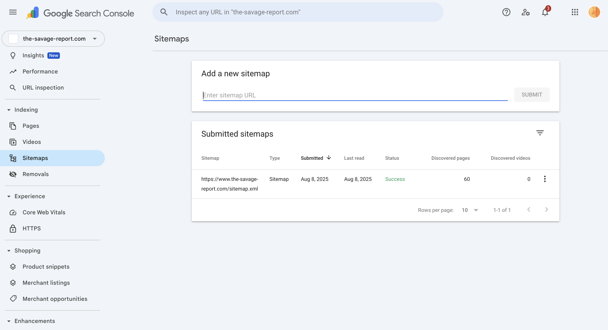

# SEO Implementation & Strategy - The Savage Report

## What This Is & Why It Matters
We implemented foundational SEO across The Savage Report to help search engines understand the site quickly, index the right pages, and present high-quality results that drive traffic and sales.

## SEO Implementation Summary

| Priority | Area | What We Delivered | Date(s) | Status | Evidence Link(s) |
|----------|------|-------------------|---------|--------|------------------|
| High | Core Web Vitals & Speed | Performance work that improves LCP/CLS/FID (see performance doc) | Aug 2025 | ✅ Active | [PageSpeed Insights Report](https://pagespeed.web.dev/report?url=https://the-savage-report.com) · [Performance Doc](./06-page-speed-optimization.md) |
| High | Metadata & Open Graph | Brand-consistent titles, optimized descriptions, Open Graph for key pages | Jul–Aug 2025 | ✅ Active | [Webflow Site Settings](https://webflow.com/dashboard/sites/savage-report-we/general) |
| High | XML Sitemap | Auto-generated sitemap enabled and verified | Aug 2025 | ✅ Active | [Sitemap](https://the-savage-report.com/sitemap.xml) · [GSC Sitemaps](https://search.google.com/search-console/sitemaps?resource_id=sc-domain:the-savage-report.com) |
| High | Robots.txt | Configured to prevent crawl waste and allow key pages; verified in GSC | Aug 2025 | ✅ Active | [robots.txt](https://the-savage-report.com/robots.txt) · [GSC Robots.txt Tester](https://search.google.com/u/5/search-console/settings/robots-txt?resource_id=sc-domain%3Athe-savage-report.com) |
| High | Domain & SSL | Proper HTTPS and canonical host (www and non-www) configuration | Aug 2025 | ✅ Active | [Webflow Site Settings](https://webflow.com/dashboard/sites/savage-report-we/general) |
| High | Canonical URLs | Self-referencing canonicals implemented sitewide | Aug 2025 | ✅ Active | [Homepage (view source to verify)](https://the-savage-report.com/) |
| Medium | URL Structure | Clean, SEO-friendly slugs across pages and collections | Jul 2025 | ✅ Active | [Webflow Designer (Pages/Slugs)](https://webflow.com/dashboard/sites/savage-report-we/designer) |
| Medium | Site Architecture | Added "Shop All" index; optimized CMS collections and content staging | Aug 2025 | ✅ Active | [CMS Structure Doc](./04-cms-structure.md) |
| Medium | Mobile SEO | Simplified mobile header; improved mobile UX structure | Aug 2025 | ✅ Active | [PageSpeed Insights (Mobile Tab)](https://pagespeed.web.dev/report?url=https://the-savage-report.com) |
| Medium | Structured Data (Schema) | Prepared Product, Organization, Local Business, Website schemas; paused to avoid perf conflicts | Jul 25–28, 2025 | ⏸️ Paused | See examples below |

> See also: 📚 [XML Sitemap Management](../knowledge-hub/seo/xml-sitemap-management.md)

## What We Implemented (Concise)

### 1) Structured Data (Schema Markup)
- Prepared JSON-LD for Product, Organization, Local Business, and Website
- Currently inactive to avoid conflicts with the performance optimizer; ready to enable after compatibility validation
- Goal: enable rich results (stars, price, brand info) without compromising speed

### 2) SEO-Optimized Content & Metadata
- Added SEO text blocks on collection pages (human-first, keyword-informed)
- Implemented consistent, brand-first meta titles and optimized descriptions
- Added Open Graph tags for improved social sharing
- Standardized URL slugs using best practices

### 3) Technical SEO
- Enabled and verified auto XML sitemap
- Configured robots.txt for efficient crawling (verified in GSC)
- Implemented self-referencing canonicals sitewide
- Ensured HTTPS across domains with proper www/non-www handling
- Improved site architecture ("Shop All" index, optimized CMS collections, staged non-core pages)

### 4) Mobile & Performance
- Mobile layout improvements (e.g., simplified homepage header for speed)
- Core Web Vitals improved with performance work (see performance doc)

## Site Architecture (At a Glance)
```
Customers → Webflow (Pages, CMS) → Smootify (Bridge) → Shopify (Products, Orders)
                           ↘ XML Sitemap / robots.txt ↙      
```

## Core Web Vitals Snapshot
- Track with PageSpeed Insights (mobile/desktop) and internal monitoring
- Key metrics: LCP < 2.5s, CLS < 0.1, INP < 200ms
- Evidence: [PSI Report](https://pagespeed.web.dev/report?url=https://the-savage-report.com)

## Sitemaps in Google Search Console (Admin Reference)
This is where you can review and manage sitemap status over time (status, last read, discovered URLs). After publishing significant changes, revisit this page to resubmit if needed.



- Open: [GSC Sitemaps](https://search.google.com/search-console/sitemaps?resource_id=sc-domain:the-savage-report.com)

## Schema Markup (Re‑enabled)
- Removed the Performance Optimizer NoSchema blocker
- Created a new inline script “Active Schema Markup” (v2.0.0)
  - Organization, WebSite, LocalBusiness schemas
  - Loaded in the site header for consistent coverage
- Location: Webflow → Project Settings → Custom Code → Head
  - Link: [webflow.com/dashboard/sites/savage-report-we/custom-code](https://webflow.com/dashboard/sites/savage-report-we/custom-code)
- Next steps after any change:
  - Publish the site (Webflow)
  - Validate with [Rich Results Test](https://search.google.com/test/rich-results) and [Search Console](https://search.google.com/search-console)

## Schema JSON-LD (Examples)

Organization
```html
<script type="application/ld+json">
{
  "@context": "https://schema.org",
  "@type": "Organization",
  "name": "THE SAVAGE REPORT",
  "url": "https://the-savage-report.com",
  "logo": "https://the-savage-report.com/assets/logo.png"
}
</script>
```

Product (template)
```html
<script type="application/ld+json">
{
  "@context": "https://schema.org",
  "@type": "Product",
  "name": "{{product.name}}",
  "image": ["{{product.imageUrl}}"],
  "description": "{{product.description}}",
  "brand": {"@type": "Brand", "name": "THE SAVAGE REPORT"},
  "offers": {
    "@type": "Offer",
    "priceCurrency": "USD",
    "price": "{{product.price}}",
    "availability": "https://schema.org/InStock"
  }
}
</script>
```

## Useful Links
- Webflow Site Settings: [webflow.com/dashboard/sites/savage-report-we/general](https://webflow.com/dashboard/sites/savage-report-we/general)
- Webflow Designer: [webflow.com/dashboard/sites/savage-report-we/designer](https://webflow.com/dashboard/sites/savage-report-we/designer)
- Google Search Console (Property): [search.google.com/search-console?resource_id=sc-domain:the-savage-report.com](https://search.google.com/search-console?resource_id=sc-domain:the-savage-report.com)
- GSC Robots.txt Tester: [search.google.com/u/5/search-console/settings/robots-txt?resource_id=sc-domain:the-savage-report.com](https://search.google.com/u/5/search-console/settings/robots-txt?resource_id=sc-domain%3Athe-savage-report.com)
- GSC Sitemaps: [search.google.com/search-console/sitemaps?resource_id=sc-domain:the-savage-report.com](https://search.google.com/search-console/sitemaps?resource_id=sc-domain:the-savage-report.com)
- PageSpeed Insights: [pagespeed.web.dev/report?url=https://the-savage-report.com](https://pagespeed.web.dev/report?url=https://the-savage-report.com)
- Live Sitemap: [the-savage-report.com/sitemap.xml](https://the-savage-report.com/sitemap.xml)
- Robots: [the-savage-report.com/robots.txt](https://the-savage-report.com/robots.txt)
- Performance Doc: [docs/06-page-speed-optimization.md](./06-page-speed-optimization.md)
- XML Sitemap Management (Guide): [knowledge-hub/seo/xml-sitemap-management.md](../knowledge-hub/seo/xml-sitemap-management.md)

---
*Last Updated: August 2025*  
*Document Version: 1.5*  
*Maintained by: Displace Agency*
