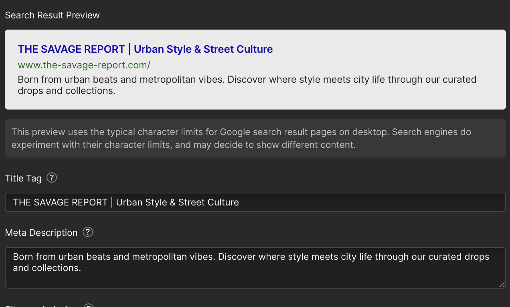

# SEO Implementation & Strategy - The Savage Report

## What This Is & Why It Matters
We implemented foundational SEO so search engines understand the site quickly, index the right pages, and present high‑quality results that drive traffic and sales.

## SEO Implementation Summary

| Item | What We Delivered | Impact | Status | Reference Link(s) |
|------|-------------------|--------|--------|-------------------|
| [Structured Data (Schema Markup)](#structured-data-schema-markup) | JSON‑LD for Product, Organization, Local Business, and Website | High | Active | [Schema Markup Doc](./05.1-seo-schema.md) |
| [SEO‑Optimized Content & Metadata](#seo-optimized-content--metadata) | Brand‑consistent titles, descriptions, Open Graph tags, optimized URL slugs | High | Active | <a href="https://webflow.com/design/savage-report-we" target="_blank" rel="noopener noreferrer">Webflow Designer</a> |
| [Robots.txt Configuration](#robots-txt-configuration) | Webflow robots management with clear crawl directives | High | Active | <a href="https://the-savage-report.com/robots.txt" target="_blank" rel="noopener noreferrer">Live robots.txt</a> · <a href="https://webflow.com/dashboard/sites/savage-report-we/seo" target="_blank" rel="noopener noreferrer">Webflow SEO Settings</a> |
| [XML Sitemap Implementation](#xml-sitemap-implementation) | Auto‑generated sitemap, verified in Google Search Console | High | Active | <a href="https://www.the-savage-report.com/sitemap.xml" target="_blank" rel="noopener noreferrer">Sitemap</a> · <a href="https://search.google.com/search-console/sitemaps?resource_id=sc-domain:the-savage-report.com" target="_blank" rel="noopener noreferrer">GSC Sitemaps</a> |
| [Webflow SEO Settings](#webflow-seo-settings) | Canonical URLs and traffic controls for search engine crawlers and AI bots | Medium | Active | <a href="https://webflow.com/dashboard/sites/savage-report-we/seo" target="_blank" rel="noopener noreferrer">SEO Settings</a> |

> See also: [XML Sitemap Management](../knowledge-hub/seo/xml-sitemap-management.md)

## Structured Data (Schema Markup)
- JSON‑LD prepared for Product, Organization, Local Business, and Website
- Enables rich results (price, availability, brand info) where supported
- See configuration and validation workflow: [Schema Markup](./05.1-seo-schema.md)

## SEO‑Optimized Content & Metadata
- Brand‑first meta titles and optimized descriptions
- Open Graph tags for improved social sharing
- Standardized URL slugs using best practices

## Robots.txt Configuration

Manage robots.txt in Webflow → SEO Settings. This controls crawling for your main website content, products, and collections.

- **Purpose**: Control search engine crawling behavior and set global canonical URL
- **Live file**: <a href="https://the-savage-report.com/robots.txt" target="_blank" rel="noopener noreferrer">https://the-savage-report.com/robots.txt</a>
- **Location**: <a href="https://webflow.com/dashboard/sites/savage-report-we/seo" target="_blank" rel="noopener noreferrer">Webflow → SEO Settings</a>

## XML Sitemap Implementation

### Sitemap Summary
- **Auto‑generated** by Webflow CMS
- **Location**: <a href="https://www.the-savage-report.com/sitemap.xml" target="_blank" rel="noopener noreferrer">www.the-savage-report.com/sitemap.xml</a>
- **Verified in GSC**: <a href="https://search.google.com/search-console/sitemaps?resource_id=sc-domain:the-savage-report.com" target="_blank" rel="noopener noreferrer">GSC Sitemaps</a>

## Webflow SEO Settings

### Canonical URLs
Set global canonical URL to prevent duplicate content and ensure proper indexing.

- **Configuration**: Global canonical URL set to `https://www.the-savage-report.com`
- **Location**: <a href="https://webflow.com/dashboard/sites/savage-report-we/seo" target="_blank" rel="noopener noreferrer">Webflow → SEO Settings</a>

### Traffic Controls
Control access for search engine crawlers and AI bots.

- **Configuration**: Search engines and AI bots allowed access
- **Location**: <a href="https://webflow.com/dashboard/sites/savage-report-we/seo" target="_blank" rel="noopener noreferrer">Webflow → SEO Settings</a>

### Advanced Publishing Settings

- **Purpose**: Configure advanced publishing options for your site
- **Location**: <a href="https://webflow.com/dashboard/sites/savage-report-we/general" target="_blank" rel="noopener noreferrer">Webflow → General Configuration</a>

### Google Site Verification & Indexing Controls

## Useful Links

### Implementation
- Webflow Custom Code: [Project Scripts](https://webflow.com/dashboard/sites/savage-report-we/custom-code)
- Webflow Settings: [General Configuration](https://webflow.com/dashboard/sites/savage-report-we/general)

### Testing & Validation
- GSC Performance: [Search Analytics](https://search.google.com/search-console/performance/search-analytics?resource_id=sc-domain:the-savage-report.com)
- GSC Sitemaps: [Submission & Status](https://search.google.com/search-console/sitemaps?resource_id=sc-domain:the-savage-report.com)
- Robots.txt (Live): [View File](https://the-savage-report.com/robots.txt)

---
*Last Updated: August 2025*  
*Document Version: 1.0*  
*Maintained by: Displace Agency*

