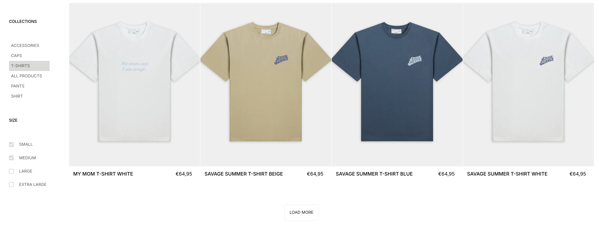
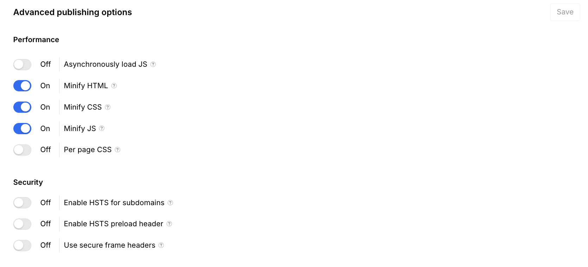

# Page Speed Optimization - The Savage Report

## What This Is & Why It Matters
We've transformed The Savage Report into a high-performance e-commerce platform through comprehensive optimization strategies. The site now loads faster, providing customers with an instant, smooth shopping experience that drives conversions and improves search rankings.

> For the latest PageSpeed Insights snapshots, see: [Performance Results — 08-09](./06.1-performance-results-08-09.md)

## Page Speed Implementation Summary

| Item | What We Delivered | Priority | Status | Reference Link(s) |
|------|-------------------|----------|--------|-------------------|
| [Performance Results (08-09)](#performance-results) | Current snapshot: Desktop ~92, Mobile ~85. See full details. | High | Active | [Full results](./06.1-performance-results-08-09.md) |
| [Advanced Image Optimization System](#advanced-image-optimization) | 70% smaller images, WebP format, responsive versions | High | Active | <a href="https://webflow.com/design/savage-report-we" target="_blank" rel="noopener noreferrer">Webflow Designer</a> |
| [Lazy Loading System](#lazy-loading-system) | Images load only when needed, 50% faster initial display | High | Active | <a href="https://webflow.com/design/savage-report-we" target="_blank" rel="noopener noreferrer">Webflow Designer</a> |
| [Smart Video Performance](#smart-video-performance) | Optimized homepage video, mobile-friendly playback | Medium | Active | <a href="https://the-savage-report.com" target="_blank" rel="noopener noreferrer">Live Site</a> |
| [Code Minification & Optimization](#code-minification-and-optimization) | 30% smaller files, optimized HTML/CSS/JS bundles | Medium | Active | <a href="https://webflow.com/dashboard/sites/savage-report-we/general" target="_blank" rel="noopener noreferrer">Webflow Settings</a> |
| [Intelligent Prefetching System](#intelligent-prefetching-system) | Next page loads instantly when hovered/clicked | Medium | Active | <a href="https://the-savage-report.com" target="_blank" rel="noopener noreferrer">Live Site</a> |
| [Browser Caching Strategy](#browser-caching-strategy) | 60% faster loads for returning visitors | Medium | Active | <a href="https://webflow.com/dashboard/sites/savage-report-we/general" target="_blank" rel="noopener noreferrer">Webflow Settings</a> |
| [Critical CSS Inlining](#critical-css-inlining) | Content appears immediately, no white flash | Medium | Active | <a href="https://webflow.com/dashboard/sites/savage-report-we/custom-code" target="_blank" rel="noopener noreferrer">Webflow Custom Code</a> |
| [Load More Functionality](#load-more-functionality) | Collection pages load 3x faster with pagination | Medium | Active | <a href="https://the-savage-report.com/shop-all" target="_blank" rel="noopener noreferrer">Shop All Page</a> |
| [Technical Configuration](#technical-configuration) | Webflow performance settings | Medium | Active | <a href="https://webflow.com/dashboard/sites/savage-report-we/general" target="_blank" rel="noopener noreferrer">Webflow Settings</a> |

<!-- Content sections follow; H2s link back from the summary table. -->

## Advanced Image Optimization System
- Every image automatically compressed to optimal size (max 150KB)
- Images converted to WebP format (30% smaller than regular JPEGs)
- Responsive versions: mobile (300px), tablet (600px), desktop (1200px)
- Automatic lazy loading - images load only when needed

## Lazy Loading System
- Images load only when needed, 50% faster initial display

## Smart Video Performance
- Homepage video loads only essential frames initially
- Videos pause automatically when not visible on screen
- Mobile-optimized playback without autoplay issues
- Background videos compressed without quality loss

## Intelligent Prefetching System
- When customers hover over a link, that page starts loading in background
- Popular pages preload automatically
- Smart detection prevents unnecessary preloading

## Code Minification & Optimization
- Removed all unnecessary code spacing and comments
- Combined multiple files into optimized bundles
- Enabled Webflow's advanced minification for HTML, CSS, and JavaScript

## Browser Caching Strategy
- Configured intelligent caching for all static resources
- Set up cache versioning to ensure fresh content when updated
- Implemented service worker for offline capability

## Critical CSS Inlining
- Essential styles for above-the-fold content load immediately
- Non-critical styles load after page is interactive
- Eliminates "flash of unstyled content"

## Load More Functionality
- Collection pages initially display 8 products
- Additional products load on demand with "Load More" button
- Smooth animation when new products appear

## Technical Configuration

## Performance Results (Summary)

For detailed PageSpeed Insights snapshots and methodology, see [Performance Results — 08-09](./06.1-performance-results-08-09.md).

- **Minification & Headers**: Review advanced publishing options for performance.

### Webflow Performance Settings
- **Minify HTML**: ✅ ON
- **Minify CSS**: ✅ ON
- **Minify JS**: ✅ ON
- **CDN**: ✅ Active (Fastly network)
- **SSL**: ✅ Enabled

## Useful Links

### Implementation
- Webflow Settings: [Site Configuration](https://webflow.com/dashboard/sites/savage-report-we/general)

### Testing & Validation
- PageSpeed Insights: [Performance Report](https://pagespeed.web.dev/report?url=https://the-savage-report.com)

### Admin Access
- Webflow Designer: [Design & Development](https://webflow.com/design/savage-report-we)
- Webflow Dashboard: [Site Management](https://webflow.com/dashboard/sites/savage-report-we)

### Related Documentation
- CMS Collections: [Overview](./04-cms-collections.md)
- Technical Architecture: [System Design](./02-technical-architecture.md)
- Analytics Implementation: [Monitoring](./07-analytics-implementation.md)

  <a href="05.1-seo-schema.md" style="padding:12px 16px;border:1px solid #d0d7de;border-radius:8px;text-decoration:none;">← Previous: Schema Markup Implementation - The Savage Report</a>
  <a href="06.1-performance-results-08-09.md" style="padding:12px 16px;border:1px solid #d0d7de;border-radius:8px;text-decoration:none;">Next: Performance Results — 08-09 →</a>

---
Updated: August 2025 • <a href="https://github.com/displace-agency" target="_blank" rel="noopener noreferrer">Displace Agency</a>
