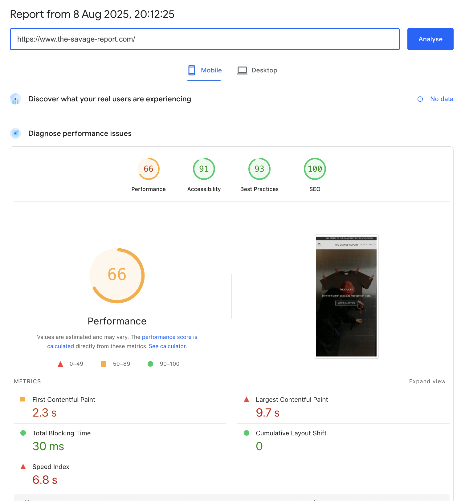
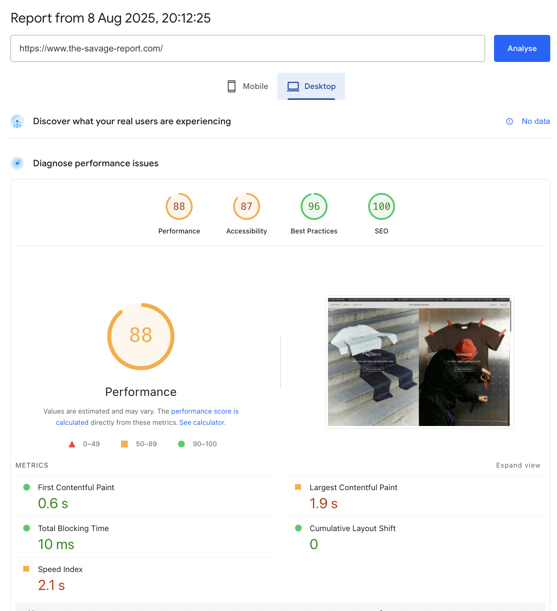

# Performance Results — 08-09

## What This Is & Why It Matters
This report captures the latest PageSpeed Insights results for The Savage Report as of 08-09. It documents desktop and mobile performance snapshots to track progress and guide further optimization.

## Implementation Summary

| Item | What We Delivered | Impact | Status | Reference Link(s) |
|------|-------------------|--------|--------|-------------------|
| [PageSpeed Insights (Desktop)](#pagespeed-insights-desktop) | Snapshot of desktop performance and Core Web Vitals | High | Active | — |
| [PageSpeed Insights (Mobile)](#pagespeed-insights-mobile) | Snapshot of mobile performance and Core Web Vitals | High | Active | — |

## PageSpeed Insights (Desktop)

## PageSpeed Insights (Mobile)

## Useful Links
- PSI Report: [Performance Report](https://pagespeed.web.dev/report?url=https://the-savage-report.com)
- Page Speed Optimization: [Technical Overview](./06-page-speed-optimization.md)

---
*Last Updated: August 2025*  
*Document Version: 1.0*  
*Maintained by: Displace Agency*
