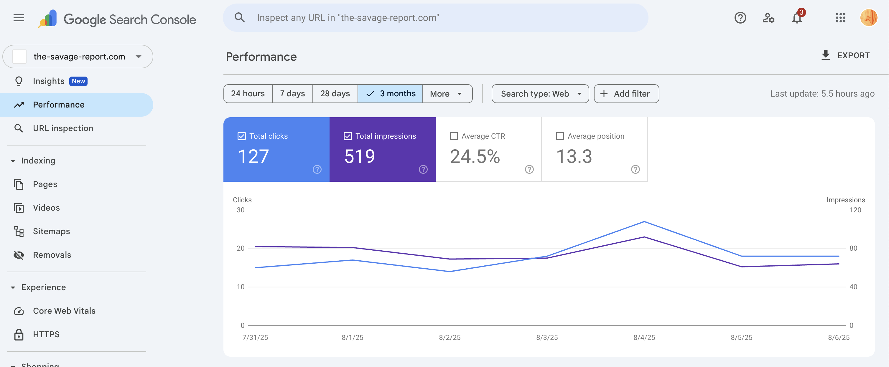
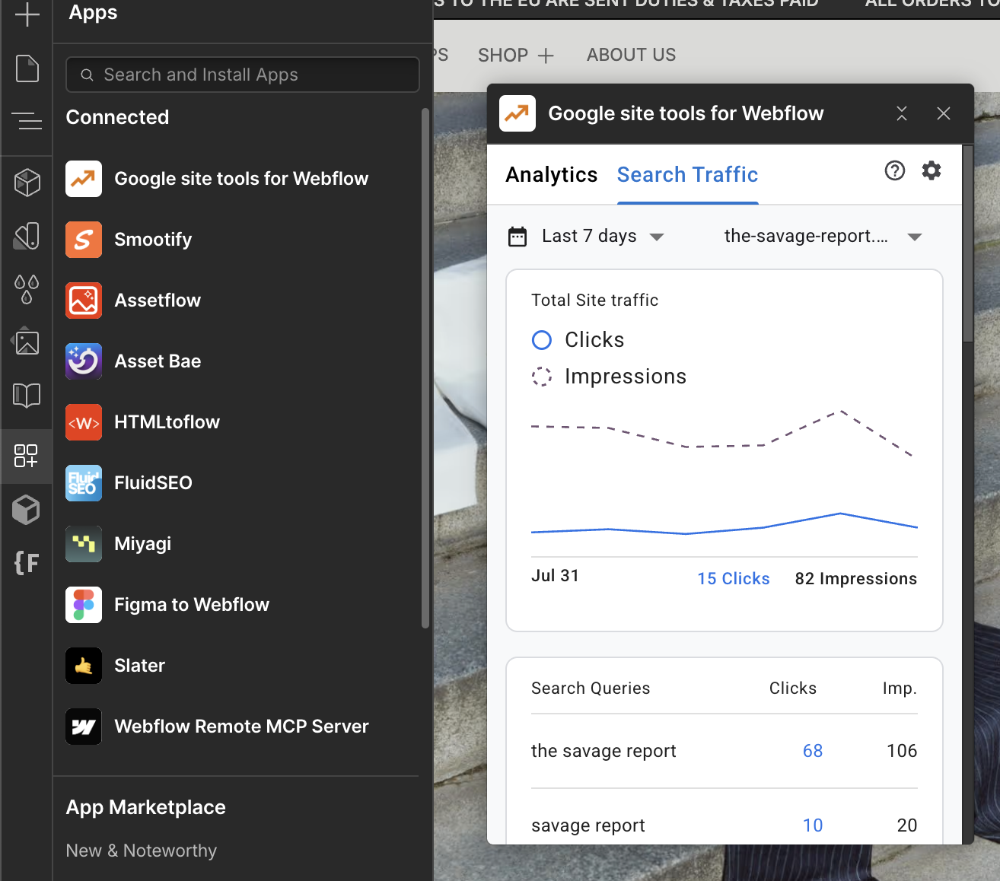
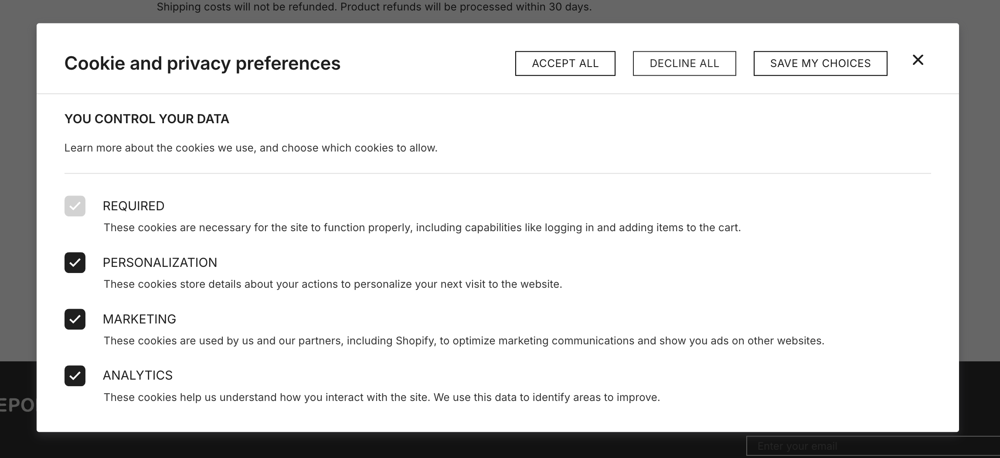
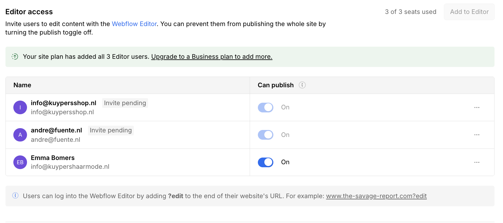
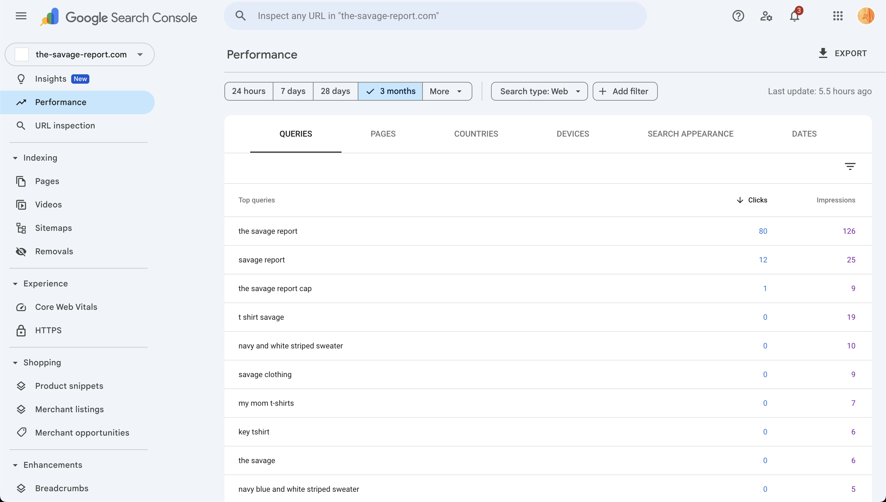
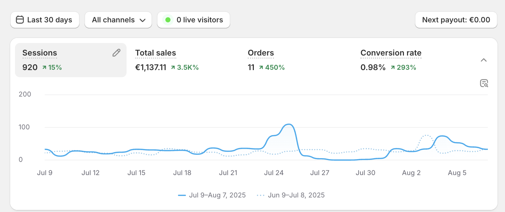

# Analytics Implementation & Monitoring - The Savage Report

## What This Is & Why It Matters
We've implemented comprehensive analytics tracking across The Savage Report to provide data-driven insights into website performance, search visibility, and e-commerce metrics. This enables informed decision-making and optimization opportunities.

## Analytics Implementation Summary

| Item | What We Delivered | Priority | Date(s) | Status | Reference Link(s) |
|------|-------------------|----------|---------|--------|-------------------|
| [Google Search Console](#1-google-search-console-integration) | Site verification, search performance tracking, sitemap monitoring | High | Aug 2025 | Active | <a href="https://search.google.com/u/5/search-console/performance/search-analytics?resource_id=sc-domain%3Athe-savage-report.com" target="_blank" rel="noopener noreferrer">GSC Performance</a> |
| [Webflow Google Search](#2-webflow-google-search-integration) | Integrated GSC data display within Webflow dashboard | Medium | Aug 2025 | Active | <a href="https://webflow.com/dashboard/sites/savage-report-we" target="_blank" rel="noopener noreferrer">Webflow Dashboard</a> |
| [Google Analytics](#3-google-analytics-configuration) | Measurement ID configured in Webflow settings | Medium | Aug 2025 | Paused | <a href="https://webflow.com/dashboard/sites/savage-report-we/general" target="_blank" rel="noopener noreferrer">Webflow Settings</a> |

## What We Implemented

### 1) Google Search Console Integration
- Site verification completed with ownership confirmation
- Search performance tracking enabled for organic traffic insights
- Sitemap submission and monitoring for indexing status
- Core Web Vitals and mobile usability monitoring

### 2) Webflow Google Search Integration
- Google Search Console data displayed directly in Webflow dashboard
- Real-time search performance metrics
- Integrated monitoring without external platform switching

### 3) Google Analytics Configuration
- Measurement ID configured in Webflow settings
- Tracking code properly implemented
- Account access pending (agency doesn't have access)

## Analytics Platforms Overview

### Google Search Console (Primary Search Analytics)
**Purpose**: Monitor search performance, indexing status, and technical SEO health

- **Primary Metrics**: Search queries, click-through rates, impressions, average position
- **Technical Monitoring**: Core Web Vitals, mobile usability, indexing status
- **Access**: <a href="https://search.google.com/u/5/search-console/performance/search-analytics?resource_id=sc-domain%3Athe-savage-report.com" target="_blank" rel="noopener noreferrer">GSC Performance Dashboard</a>
- **Verification**: Site ownership confirmed and verified

### Webflow Google Search Integration
**Purpose**: Display GSC data directly within Webflow dashboard for convenience

- **Features**: Real-time GSC data display, search performance metrics
- **Access**: <a href="https://webflow.com/dashboard/sites/savage-report-we" target="_blank" rel="noopener noreferrer">Webflow Dashboard</a> · <a href="https://savage-report-we.design.webflow.com/" target="_blank" rel="noopener noreferrer">Webflow Designer</a>
- **Status**: Active and displaying current search performance data

## Google Analytics Status

### Current Configuration
- **Measurement ID**: Configured in Webflow settings
- **Tracking Code**: Properly implemented across all pages
- **Account Access**: Agency doesn't have access to the GA account
- **Status**: Paused until account access is provided

- **Configuration**: Measurement ID properly configured in Webflow project settings
- **Status**: Tracking code implemented but account access pending

## Key Metrics to Monitor

### Search Performance (GSC)
- **Search Queries**: What terms people use to find the site
- **Click-Through Rate**: Percentage of impressions that result in clicks
- **Average Position**: Average ranking position in search results
- **Impressions**: How often the site appears in search results

- **Search Queries**: Monitor which keywords are driving traffic to the site
- **Performance Tracking**: Track CTR, impressions, and average position for each query

### Technical Performance
- **Core Web Vitals**: LCP, FID, CLS scores from PageSpeed Insights
- **Mobile Usability**: Mobile-specific performance metrics
- **Indexing Status**: How many pages are indexed by Google

## Other Analytics Sources

### Shopify Analytics
**Purpose**: Track sales performance, customer behavior, and business metrics

- **Primary Metrics**: Sales, orders, customers, conversion rates, product performance
- **Business Insights**: Revenue trends, customer acquisition, inventory management
- **Access**: <a href="https://admin.shopify.com/store/thesavagereport/analytics" target="_blank" rel="noopener noreferrer">Shopify Analytics</a>
- **Integration**: Fully connected to e-commerce operations

## Useful Links

### Analytics Dashboards
- GSC: [Performance Dashboard](https://search.google.com/u/5/search-console/performance/search-analytics?resource_id=sc-domain%3Athe-savage-report.com)
- Webflow Dashboard: [Integrated Analytics](https://webflow.com/dashboard/sites/savage-report-we)

### Admin Access
- Shopify Admin: [Store Management](https://admin.shopify.com/store/thesavagereport)
- Webflow Settings: [Analytics Configuration](https://webflow.com/dashboard/sites/savage-report-we/general)
- Google Search Console: [Account](https://search.google.com/search-console)

### Related Documentation
- CMS Collections: [Overview](./04-cms-collections.md)
- Schema Markup: [Implementation Guide](./05.1-seo-schema.md)
- Page Speed Optimization: [Performance](./06-page-speed-optimization.md)

---
*Last Updated: August 2025*  
*Document Version: 1.0*  
*Maintained by: Displace Agency*
