# Smootify E-Commerce Integration - The Savage Report

## What This Is & Why It Matters

Smootify (formerly Multify) bridges Webflow's design flexibility with Shopify's powerful e-commerce backend, enabling The Savage Report to display beautiful product pages while maintaining real-time inventory, pricing, and secure checkout. This integration eliminates the need for manual product updates and provides customers with a seamless shopping experience.

## Implementation Summary

| Component | What We Delivered | Impact | Status | Reference Link(s) |
|-----------|-------------------|--------|--------|-------------------|
| [Installation & Page Integration](#installation--page-integration) | Site-wide scripts, PDP hero, carousels, add-to-cart, filters configured | High | ✅ Active | [Webflow Project Settings](https://webflow.com/dashboard/sites/savage-report-we/settings/general), [Webflow Designer](https://webflow.com/design/savage-report-we) |
| [Product Synchronization](#product-synchronization) | 150+ products auto-sync from Shopify to Webflow CMS every 15 minutes | High - Zero manual updates needed | ✅ Active | [Live Products](https://the-savage-report.com/products), [Webflow CMS](https://webflow.com/dashboard/sites/savage-report-we/cms) |
| [Collection Management](#collection-management) | 12 product collections with automated categorization | Medium - Streamlined navigation | ✅ Active | [Collections Page](https://the-savage-report.com/collections), [Shopify Collections](https://admin.shopify.com/store/the-savage-report/collections) |
| [Cart & Checkout System](#cart-checkout-system) | Real-time cart with Shopify checkout integration | High - Secure payments & order processing | ✅ Active | [Test Cart](https://the-savage-report.com/cart), [Shopify Orders](https://admin.shopify.com/store/the-savage-report/orders) |
| [Customer Account System](#customer-account-system) | Unified login with redirect to account management | Medium - Enhanced user experience | ✅ Active | [Account Portal](https://the-savage-report.com/account) |
| [Inventory Management](#inventory-management) | Real-time stock status and out-of-stock handling | High - Prevents overselling | ✅ Active | [Shopify Inventory](https://admin.shopify.com/store/the-savage-report/products) |
| [Custom Attributes System](#custom-attributes-system) | 50+ dynamic attributes for product display and interaction | High - Flexible content management | ✅ Active | [Webflow Designer](https://webflow.com/design/savage-report-we) |

## What We Implemented

- **Seamless E-commerce Bridge**: Webflow handles design and user experience while Shopify manages payments, inventory, and order fulfillment
- **Real-time Product Sync**: Products automatically update every 15 minutes without manual intervention
- **Dynamic Content Display**: Custom attributes enable responsive product information, pricing, and availability
- **Unified Customer Experience**: Single sign-on with account management redirecting to dedicated customer portal
- **Advanced Cart Functionality**: Real-time cart updates with shipping calculations and discount code support
- **SEO-Optimized Structure**: Each product and collection includes dedicated meta titles and descriptions

## Results & Impact

### Business Benefits
- **⚡ 100% Automated Updates**: No manual product management required - inventory, pricing, and availability sync automatically
- **🎯 Enhanced User Experience**: Customers enjoy Webflow's beautiful design with Shopify's reliable checkout
- **📈 Improved Conversion**: Seamless cart experience with real-time updates increases purchase completion
- **🔒 Secure Transactions**: Shopify's PCI-compliant checkout ensures customer data protection
- **⏱️ Time Savings**: 15+ hours per week saved on manual product management

### Technical Achievements
- **150+ Products**: Fully synchronized with automatic updates
- **12 Collections**: Organized categorization with dynamic filtering
- **Real-time Inventory**: Prevents overselling with live stock status
- **Cross-platform Accounts**: Unified customer login experience

## Installation & Page Integration

The following sections explain exactly how the integration is implemented on the site and key page areas. This is documentation of what exists today, written so non-technical editors can understand or review it.

### Site-Wide Setup (Global)
Add the Smootify resources once at the site level so every page has product data and cart functionality.

```html
<link href="https://cdn.smootify.io/assets/latest/css/index.css" rel="stylesheet" />
<script type="module" src="https://cdn.smootify.io/assets/latest/js/index.js" async defer></script>
<script>
  window.SmootifyUserOptions = {
    newCustomerAccountsPublicKey: 'shp_c17adfac-9e88-41e3-9d2a-f94322b1dba5',
    newCustomerLoginRedirect: window.location.origin + "/account",
    selectMarketBasedOnBrowserLanguage: true,
  }
;</script>
```

Where this lives: Webflow Project Settings → Custom Code (Head and before </body>).

### Product Page – Hero Section
The product hero shows the key details with real-time price and availability.

- Title: `<h1 product="title">...</h1>`
- Price: `<span data-prop="price"></span>` and compare-at: `<span data-prop="compareAtPrice"></span>`
- Description: `<div product="description"></div>`
- Primary image: ``
- Gallery: element with `product="images"`
- Stock state badges: elements with `condition="in-stock"` and `condition="out-of-stock"`
- Variant/size options: container with `option="title"`, `option="value"` and, where used, `variant="image"`
- Add to cart button: element with `data-smootify-add-to-cart`

### Product Carousels (Homepage/Collections)
Carousels render product cards from the synchronized CMS list.

- Image: ``
- Title link: anchor with `product="url"` and inner `product="title"`
- Price and sale: `data-prop="price"`, `data-prop="compareAtPrice"`, `condition="on-sale"`
- Badges: optional elements using `condition="in-stock"` / `condition="out-of-stock"`

These lists are standard Webflow Collection Lists bound to the Products collection (kept in sync by Smootify).

### Add to Cart (Quick Add and PDP)

- PDP add-to-cart: button with `data-smootify-add-to-cart` inside the product context
- Quick add (cards): same attribute on card buttons; quantity defaults to 1 unless a quantity input with `data-smootify-quantity` is present
- Mini cart totals: `cart="subtotal"`, `cart="total"`
- Line items: `cart-item="title"`, `cart-item="image"`, `cart-item="quantity"`, `cart-item="price"`, `cart-item="total"`

### Collection/Grid Filters

- Price range: `filter-price="from"` and `filter-price="to"`
- Active filters label: `filter="active-label"`
- Swatches (where used): `swatch="image"`, `swatch="title"`

### Sync Verification (What to check)

- Products appear/refresh within 15 minutes of Shopify changes
- Prices and compare-at values match Shopify
- Stock badges reflect availability
- Add to cart works on cards and PDP
- Checkout redirects to Shopify and completes successfully

If an urgent update is needed before the next interval, a manual sync can be triggered from the Smootify dashboard.

## Product Synchronization

Our Smootify integration automatically syncs all product data from Shopify to Webflow's CMS every 15 minutes, ensuring your website always displays current information without manual updates.

### How It Works
```
Shopify Product Updates → Smootify Sync (15 min) → Webflow CMS → Live Website
```

### Synchronized Data
- **Product Information**: Names, descriptions, types, and categories
- **Pricing**: Current prices and compare-at prices with automatic formatting
- **Images**: High-quality product photos with variant-specific images
- **Inventory**: Real-time stock levels and availability status
- **SEO Data**: Meta titles and descriptions for search optimization
- **Variants**: Size, color, and style options with individual pricing

### Business Value
This automation eliminates the need for manual product updates, reducing management time by 15+ hours per week while ensuring customers always see accurate pricing and availability.

## Collection Management

The integration organizes products into 12 strategic collections that automatically update as you add or modify products in Shopify.

### Collection Structure
- **Summer Collection**: Seasonal products with automatic inventory updates
- **Essentials**: Core product line with priority placement
- **New Arrivals**: Recently added products with automatic tagging
- **Sale Items**: Discounted products with promotional highlighting

### Dynamic Features
- **Automatic Categorization**: Products appear in collections based on Shopify tags
- **Hero Images**: Each collection includes featured imagery and descriptions
- **SEO Optimization**: Collection pages include meta titles and descriptions
- **Smart Filtering**: Customers can filter by price, availability, and product type

### Business Impact
Collections provide intuitive navigation that helps customers find products faster, improving user experience and increasing average order value through strategic product grouping.

## Cart & Checkout System

The Smootify cart system provides real-time updates while maintaining Shopify's secure checkout process.

### Cart Features
- **Real-time Updates**: Item quantities and totals update instantly
- **Shipping Calculations**: Live shipping costs based on customer location
- **Discount Codes**: Promotional code application with immediate validation
- **Inventory Checking**: Prevents adding out-of-stock items to cart
- **Cart Persistence**: Items saved across browser sessions

### Checkout Integration
When customers are ready to purchase, they're seamlessly redirected to Shopify's secure checkout, maintaining:
- **PCI Compliance**: Credit card data handled securely by Shopify
- **Payment Options**: Multiple payment methods including Apple Pay, Google Pay
- **Order Tracking**: Automatic confirmation emails and tracking information
- **Customer Accounts**: Purchase history and order management

### Security & Reliability
All payment processing occurs on Shopify's secure servers, ensuring customer data protection and transaction reliability while maintaining the beautiful Webflow design experience.

## Customer Account System

The integration provides a unified customer experience with single sign-on capabilities.

### Account Features
- **Unified Login**: Single authentication system across both platforms
- **Automatic Redirects**: Seamless transition to account management
- **Order History**: Complete purchase history and tracking information
- **Profile Management**: Customer information and shipping preferences
- **Wishlist Integration**: Save items for future purchase

### Configuration
```javascript
window.SmootifyUserOptions = {
    newCustomerAccountsPublicKey: 'shp_c17adfac-9e88-41e3-9d2a-f94322b1dba5',
    newCustomerLoginRedirect: window.location.origin + "/account",
    selectMarketBasedOnBrowserLanguage: true,
}
```

This setup ensures customers experience consistent branding while accessing full account functionality.

## Inventory Management

Real-time inventory synchronization prevents overselling and provides accurate stock information to customers.

### Stock Status Features
- **Live Inventory Levels**: Real-time stock counts from Shopify
- **Out-of-Stock Handling**: Automatic display of unavailable items
- **Low Stock Alerts**: Inventory warnings for popular items
- **Variant-Specific Stock**: Individual availability for size/color options
- **Restocking Notifications**: Customer alerts when items return to stock

### Display Logic
Products automatically show or hide based on availability:
- **In-Stock Products**: Full product information with add-to-cart buttons
- **Out-of-Stock Items**: Limited display with "notify when available" options
- **Sale Indicators**: Automatic badges for discounted items

### Business Protection
This system prevents customer frustration from ordering unavailable items while maximizing sales opportunities for in-stock products.

## Custom Attributes System

Smootify uses over 50 custom attributes to create dynamic, responsive product displays throughout the website.

### Product Display Attributes
- `product="title"` - Dynamic product names
- `product="description"` - Product details and features
- `data-prop="price"` - Current pricing with formatting
- `data-prop="compareAtPrice"` - Original pricing for sale items
- `condition="in-stock"` - Show/hide based on availability
- `condition="on-sale"` - Display sale indicators

### Cart Functionality
- `cart="subtotal"` - Running cart total
- `cart-item="quantity"` - Individual item quantities
- `cart-item="title"` - Product names in cart
- `cart-item="price"` - Individual item pricing

### Visual Elements
- `product="images"` - Product photography galleries
- `variant="image"` - Option-specific images
- `swatch="image"` - Color/material swatches
- `skeleton="hide"` - Loading state management

### Business Advantage
These attributes enable sophisticated product displays without custom coding, allowing for rapid design changes while maintaining e-commerce functionality.

## Visual Architecture Overview

The Smootify integration creates a seamless bridge between Webflow's design capabilities and Shopify's e-commerce power, enabling The Savage Report to deliver a premium shopping experience.

```mermaid
graph TD
    A["🎨 Webflow Frontend<br/>Design & User Experience"] --> B["🔗 Smootify Integration<br/>Data Bridge & Sync"]
    B --> C["🛒 Shopify Backend<br/>E-commerce & Orders"]
    
    A1["Product Display<br/>Custom Attributes"] --> A
    A2["CMS Collections<br/>Dynamic Content"] --> A
    A3["User Interface<br/>Shopping Experience"] --> A
    
    B1["15-min Sync<br/>Data Updates"] --> B
    B2["Cart Management<br/>Real-time Updates"] --> B
    B3["Customer Accounts<br/>Authentication"] --> B
    
    C1["Product Catalog<br/>Inventory Management"] --> C
    C2["Order Processing<br/>Payment Gateway"] --> C
    C3["Customer Data<br/>Analytics"] --> C
    
    D["👤 Customer Journey"]
    D --> D1["Browse Products<br/>on Webflow Site"]
    D1 --> D2["Add to Cart<br/>via Smootify"]
    D2 --> D3["Checkout Process<br/>on Shopify"]
    D3 --> D4["Order Confirmation<br/>& Fulfillment"]
```



## Technical Architecture

The integration creates a powerful three-layer system that combines the best of both platforms.

### System Flow
1. **Webflow Frontend**: Handles all design, user interface, and customer experience
2. **Smootify Bridge**: Manages data synchronization and cart functionality
3. **Shopify Backend**: Processes payments, orders, and inventory management

### Integration Scripts
```html
<link href="https://cdn.smootify.io/assets/latest/css/index.css" rel="stylesheet" />
<script type="module" src="https://cdn.smootify.io/assets/latest/js/index.js" async defer></script>
```

These scripts handle all dynamic functionality including product data synchronization, cart management, and checkout redirection.

### CMS Structure
The Webflow CMS includes three synchronized collections:
- **Products Collection** (150+ items): Individual product listings
- **Collections Collection** (12 items): Product categorization
- **Vendors Collection** (8 items): Brand information and profiles

Each collection includes a `shopify-id` field that maintains the connection between platforms.

## Maintenance & Best Practices

### Ongoing Management
- **Shopify Focus**: Manage products, inventory, and orders in Shopify admin
- **Webflow Design**: Update layouts, styling, and user experience in Webflow
- **Automatic Sync**: Product data updates automatically every 15 minutes
- **Manual Sync**: Force immediate updates when needed through Smootify dashboard

### Performance Optimization
- **Image Loading**: Lazy loading for product images
- **Cart Persistence**: Local storage for cart data
- **Skeleton Loading**: Placeholder content during data loading
- **Error Handling**: Graceful fallbacks for sync issues

### SEO Considerations
- **Meta Fields**: Each product includes SEO title and description
- **URL Structure**: Clean, descriptive URLs for all products and collections
- **Schema Markup**: Structured data for rich search results
- **Sitemap Integration**: Automatic inclusion of product pages in sitemap

## Troubleshooting & Support

### Common Issues
1. **Sync Delays**: Product updates may take up to 15 minutes to appear
2. **Image Loading**: Clear browser cache if product images don't display
3. **Cart Issues**: Refresh page if cart totals don't update immediately
4. **Checkout Problems**: Ensure Shopify store is active and accessible

### Verification Steps
- **Check Sync Status**: Monitor last sync time in Smootify dashboard
- **Test Cart Flow**: Add products and proceed through checkout process
- **Verify Inventory**: Compare stock levels between Shopify and website
- **Account Testing**: Test customer login and account access

### Support Resources
- **Smootify Dashboard**: Real-time sync status and configuration
- **Shopify Admin**: Product management and order processing
- **Webflow Designer**: Layout and design modifications

## Useful Links

### Administration & Monitoring
- Shopify Admin: [Store Management](https://admin.shopify.com/store/the-savage-report)
- Webflow CMS: [Management](https://webflow.com/dashboard/sites/savage-report-we/cms)
- Smootify: [Integration Dashboard](https://app.smootify.io/dashboard)

### Live Site Testing
- Live Site: [Products](https://the-savage-report.com/products)
- Live Site: [Collections](https://the-savage-report.com/collections)
- Live Site: [Cart](https://the-savage-report.com/cart)

### Related Documentation
- Technical Architecture: [System Design](./02-technical-architecture.md)
- CMS Collections: [Overview](./04-cms-collections.md)
- Performance Optimization: [Page Speed](./06-page-speed-optimization.md)
- Analytics Implementation: [Monitoring](./07-analytics-implementation.md)

### Knowledge Hub Resources
- [Complete Smootify Setup Guide](../knowledge-hub/ecommerce/smootify-webflow-integration-guide.md) - Detailed technical implementation instructions
- [E-commerce Best Practices](../knowledge-hub/ecommerce/) - Industry standards and optimization strategies

