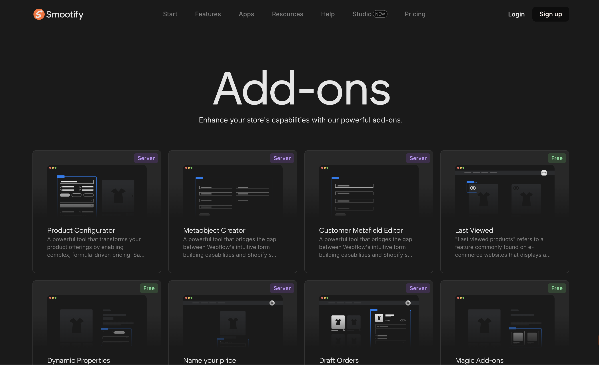
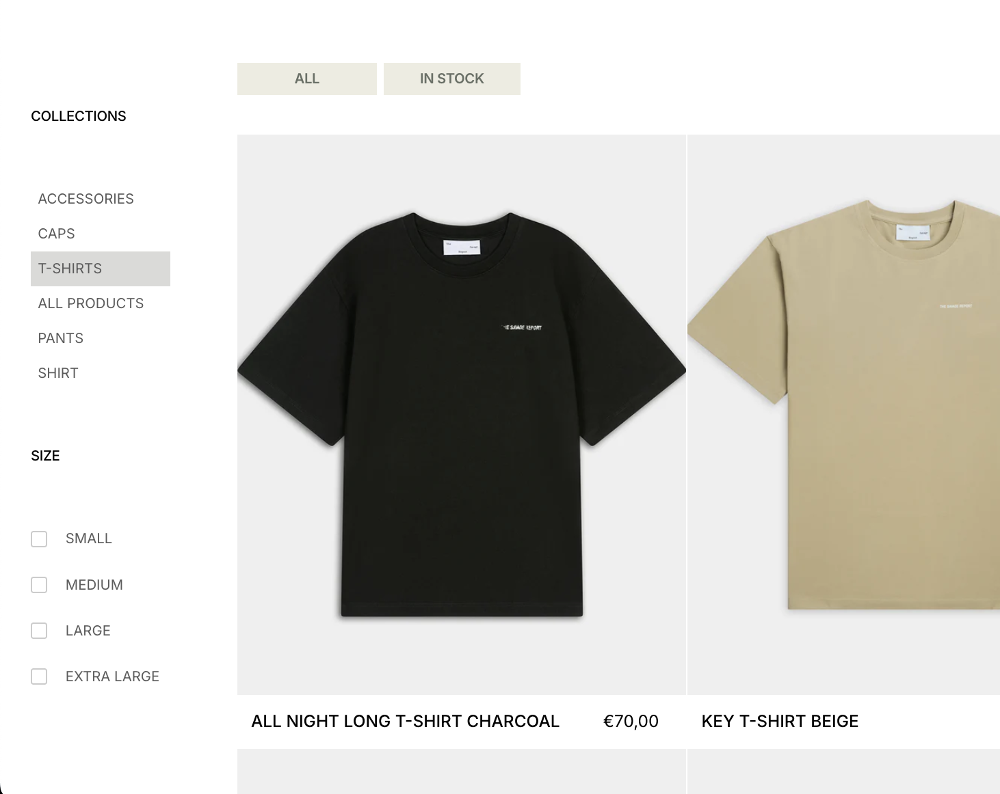
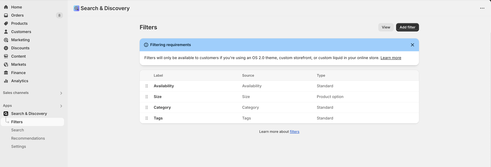
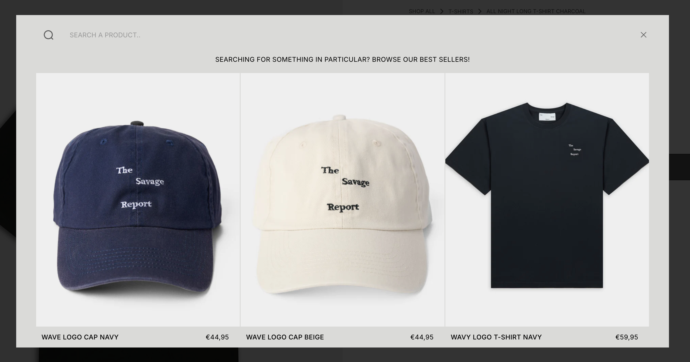
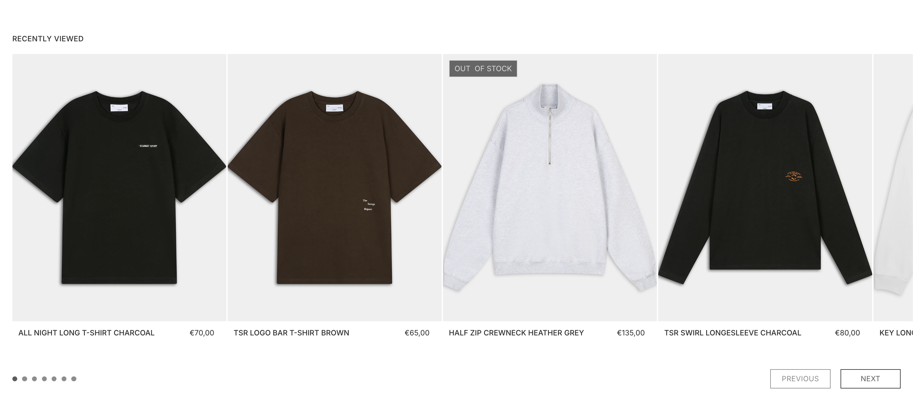
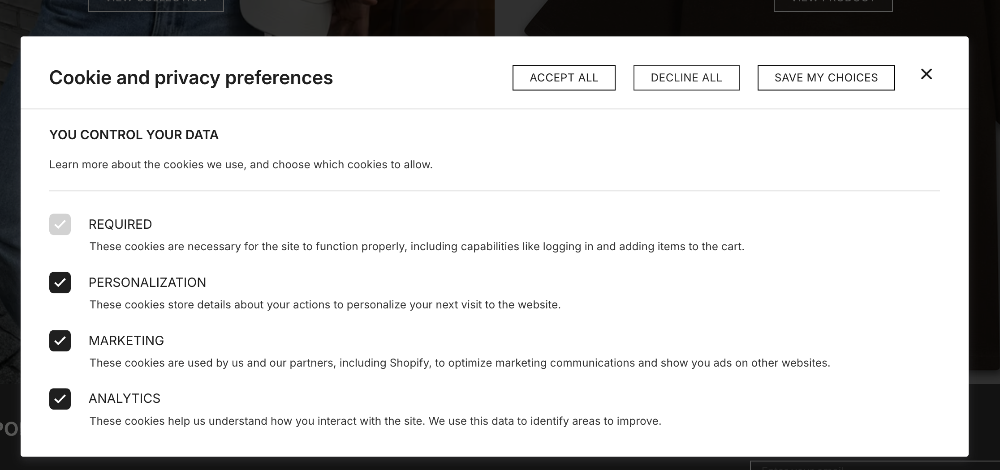
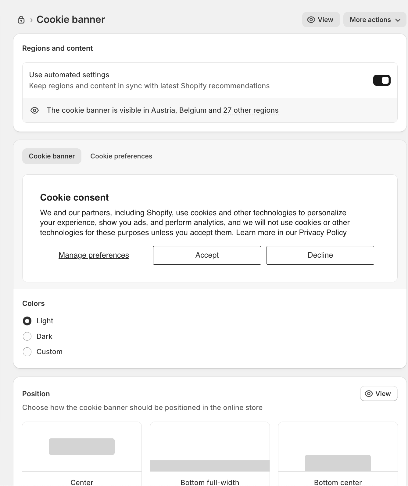

# Smootify Add‑Ons Implemented (The Savage Report)

## What This Is & Why It Matters
This article documents the Smootify add‑ons enabled for The Savage Report. These add‑ons enhance search/discovery, personalize shopping, and ensure compliance. Each section explains what the add‑on does, how it’s configured in Shopify/Webflow, and how to verify it on the live site.

## Implementation Summary

| Item | What We Cover | Status | Link |
|------|----------------|--------|------|
| [Overview](#overview) | Add‑ons enabled and where they appear | Active | — |
| [Search & Discovery](#search-discovery) | Filters, boosts, synonyms via Shopify app | Active | — |
| [Predictive Search](#predictive-search) | Type‑ahead search experience | Active | — |
| [Last Viewed](#last-viewed) | Recently viewed products per customer | Active | — |
| [Cookie Consent](#cookie-consent) | GDPR/CCPA consent banner and settings | Active | — |
| [References](#references) | Official docs and admin links | Active | — |

---

## Overview

Smootify add‑ons used on this site focus on product discovery and privacy compliance. You’ll see these features across collection/product pages and the site header search.

---

## Search & Discovery

Enhances how shoppers find products using Shopify’s free Search & Discovery app. We configure filters, boosts, and synonym groups in Shopify; Smootify components render the UI in Webflow.

- Live example: `the-savage-report.com/collection/t-shirts`
- Admin: Shopify → Apps → Search & Discovery → Filters

Key notes:
- Use custom filters for categories like size, color, and price
- Create synonym groups to match shopper language
- Feature/boost key products in results

Source docs:
- Smootify add‑on page: [Search & discovery](https://www.smootify.io/add-ons/search-discovery)
- Smootify docs: [Search & Discovery](https://docs.smootify.io/docs/search-filters/search-and-discovery)

---

## Predictive Search

Adds type‑ahead suggestions in the site header search. Shoppers see products and collections as they type, improving discovery and speed.

Notes:
- Designed to work seamlessly with the Search & Discovery configuration
- UI/behavior managed via Smootify header search component in Webflow

Source docs:
- Smootify add‑on page: [Predictive Search](https://www.smootify.io/add-ons/predictive-search)
- Smootify docs: [Search & Filters](https://docs.smootify.io/docs/search-filters)

---

## Last Viewed

Displays recently viewed products for the current visitor or signed‑in customer. With Customer Accounts, data persists across sessions.

How it works:
- Shopify: enable the Last Viewed add‑on in Smootify Dashboard
- Shopify: set the Customer metafield for Last Viewed to Read/Write
- Webflow: add a Product Custom Element with `data-id="last-viewed"`; optional `limit` attribute

Verify on live site: visit a few product pages, then check a page section titled “Recently viewed.”

Source docs:
- Smootify add‑on page: [Last Viewed](https://www.smootify.io/add-ons/last-viewed)
- Smootify docs: [Last Viewed](https://docs.smootify.io/docs/ecommerce/add-ons/last-viewed)

---

## Cookie Consent

Implements a consent banner and preference management for GDPR/CCPA compliance.

- Admin: Shopify → Settings → Customer Privacy → Consent banner

Source docs:
- Smootify docs: [Cookie Consent](https://docs.smootify.io/docs/analytics/cookie-consent)

---

## Useful Links

- Live collection with filters: [The Savage Report — T‑Shirts](https://www.the-savage-report.com/collection/t-shirts)
- Shopify Search & Discovery admin: [Filters](https://admin.shopify.com/store/thesavagereport/apps/search-and-discovery/filters)
- Live product with Recently Viewed: [All Night Long T‑Shirt (Charcoal)](https://www.the-savage-report.com/product/all-night-long-t-shirt-charcoal)
- Shopify Privacy settings: [Consent banner](https://admin.shopify.com/store/thesavagereport/settings/privacy/consent-banner?link_source=search)

## References

- Smootify add‑ons catalog: [Add‑ons](https://www.smootify.io/add-ons)
- Smootify: [Search & discovery](https://www.smootify.io/add-ons/search-discovery)
- Smootify docs: [Search & Discovery](https://docs.smootify.io/docs/search-filters/search-and-discovery)
- Smootify: [Last Viewed](https://www.smootify.io/add-ons/last-viewed)
- Smootify docs: [Last Viewed](https://docs.smootify.io/docs/ecommerce/add-ons/last-viewed)
- Smootify: [Predictive Search](https://www.smootify.io/add-ons/predictive-search)
- Smootify docs: [Search & Filters](https://docs.smootify.io/docs/search-filters)

  <a href="08-smootify-integration.md" style="padding:12px 16px;border:1px solid #d0d7de;border-radius:8px;text-decoration:none;">← Previous: Smootify E-Commerce Integration - The Savage Report</a>
  <a href="09-subscriptions.md" style="padding:12px 16px;border:1px solid #d0d7de;border-radius:8px;text-decoration:none;">Next: Subscriptions & Billing - The Savage Report →</a>

---
Updated: August 2025 • <a href="https://github.com/displace-agency" target="_blank" rel="noopener noreferrer">Displace Agency</a>
