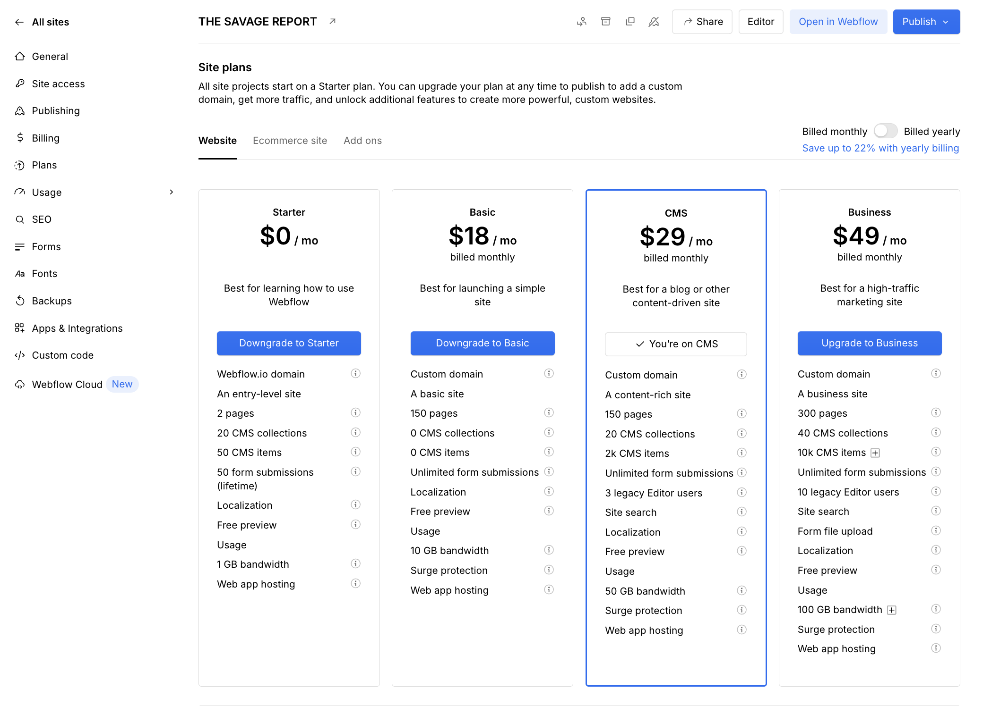

# Subscriptions & Billing - The Savage Report

## What This Is & Why It Matters
Running The Savage Report requires a few paid subscriptions that power design, content management, e‑commerce, and the integration between systems. This article documents the required subscriptions, what they cover, where to manage them, and how to verify billing status.

## Subscriptions Overview

| Item | What It Covers | Why It Matters | Status | Manage |
|------|-----------------|----------------|--------|--------|
| [Webflow](#webflow-subscription-monthly-29) | Site hosting, Designer, CMS, SEO settings, backups | Hosts the site, enables edits and publishing | Active (Monthly) | [Webflow Billing](https://webflow.com/dashboard/sites/savage-report-we/billing) |
| [Smootify (Lite)](#smootify-subscription-lite-monthly) | Webflow ↔ Shopify bridge, manual/interval sync, cart & checkout | Enables product sync, cart, and checkout | Active (Monthly) | [Smootify Plans](https://dashboard.smootify.io/site/savage-report-w/plans) |
| [Shopify](#shopify-subscription) | Store backend (products, orders, payments) | Secure checkout, order processing, analytics | Active | [Shopify Admin](https://admin.shopify.com/store/thesavagereport) |

> Note: Access to billing pages requires appropriate workspace/store permissions.

## Webflow Subscription (Monthly, $29)
The Webflow subscription covers hosting, CMS, backups, SEO settings, and Designer access for ongoing edits.

Included:
- Hosting for the live domain and SSL
- CMS features (collections, items) and publishing
- Backups/versioning for safe rollbacks
- Project settings including SEO (robots.txt, canonical URL)
- Designer access for page and layout updates

Manage: Webflow Billing → [Manage Plan](https://webflow.com/dashboard/sites/savage-report-we/billing)

## Smootify Subscription (Lite, Monthly)
Smootify connects Webflow with Shopify for product sync, cart, and checkout integration.

Included in Lite:
- Webflow ↔ Shopify integration
- Cart and checkout bridge to Shopify
- Scheduled product updates approximately every 15 minutes
- Manual "Live Sync" option to immediately push the latest changes

Not included in Lite (important):
- Automatic near‑real‑time synchronization on every change
- Advanced automation features available in higher tiers

Sync behavior:
- New products and updates typically appear in Webflow within ~15 minutes
- For urgent updates, use the Smootify desktop/web app "Sync Now" button

Learn more: Smootify Sync & Operations: [Coming soon](./10-smootify-sync-operations.md)

## Shopify Subscription
Shopify provides the e‑commerce backend for products, orders, and secure payments.

Included:
- Store admin for catalog, orders, and customers
- Payments and checkout infrastructure (PCI compliant)
- Analytics and reporting

Manage: Shopify Admin → [Store Management](https://admin.shopify.com/store/thesavagereport)

## Useful Links

### Billing & Plans
- Webflow Billing: [Manage Plan](https://webflow.com/dashboard/sites/savage-report-we/billing)
- Smootify Billing: [Plans](https://dashboard.smootify.io/site/savage-report-w/plans)
- Shopify Admin: [Store Management](https://admin.shopify.com/store/thesavagereport)

### Related Documentation
- Platform Details: [System Configuration](./03-platform-details.md)
- Smootify Integration: [Implementation Guide](./08-smootify-integration.md)
- Technical Architecture: [System Design](./02-technical-architecture.md)

  <a href="08-smootify-integration.md" style="padding:12px 16px;border:1px solid #d0d7de;border-radius:8px;text-decoration:none;">← Previous: Smootify E-Commerce Integration - The Savage Report</a>
  

---
Updated: August 2025 • <a href="https://github.com/displace-agency" target="_blank" rel="noopener noreferrer">Displace Agency</a>
