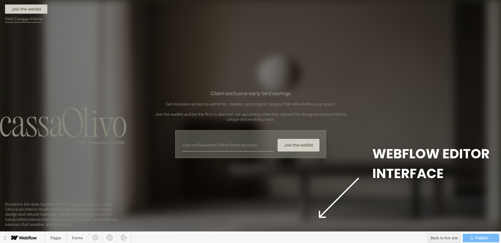

# What is Webflow and How Does It Work?

## What This Is & Why It Matters
Webflow is a visual website builder that lets Displace Agency design and ship custom, professional sites without writing code. We design visually; Webflow generates clean HTML/CSS/JS. Clients get an easy way to edit content without breaking layouts.

## Implementation Summary

| Item | What We Cover | Status | Link |
|------|----------------|--------|------|
| [Webflow Made Simple](#webflow-made-simple) | Core idea and why it fits our workflow | Active | — |
| [Key Features](#key-features) | Must‑know capabilities for teams | Active | — |
| [Webflow Designer](#webflow-designer) | Structure, style, and animations | Active | — |
| [Webflow Editor](#webflow-editor) | Safe content editing after launch | Active | — |
| [Webflow Hosting](#webflow-hosting) | Hosting, backups, CDN | Active | — |
| [Why Webflow](#why-displace-agency-chooses-webflow) | Design control, client UX, performance | Active | — |
| [Community](#webflow-community) | Made in Webflow showcase and ecosystem | Active | — |

## Webflow Made Simple
**Webflow combines professional design freedom with client‑friendly content editing.** We build unique experiences that match your brand precisely. You can edit text, swap images, and publish changes in minutes.

## Key Features
- No coding required to create production‑ready sites
- Built‑in, globally distributed hosting (CDN)
- Responsive design and mobile‑first tooling
- Visual animations and interactions
- On‑page editing for content teams

## Webflow Designer (for Displace Agency)
Where we build your site’s structure, style, and interactions.

- Semantic layout with CSS grid/flex
- Component‑based design system
- Animation timeline and scroll interactions

## Webflow Editor (for You)
Your on‑page, safe‑to‑use content editing dashboard.

- Edit text and swap images inline
- Create and publish CMS content (e.g., blog posts)
- Track changes before publishing

The Webflow Editor is the safest way for non‑technical users to update text, images, rich content, and links directly on the page. For step‑by‑step access instructions, see “How to Access Your Webflow Site.”

### Editor vs Designer — Purpose, Pros & Cons

| Item | Purpose | Pros | Cons |
|------|---------|------|------|
| Editor | Update live content (text, images, links, CMS) | Safe, visual, fast; no layout risk | Limited control over structure and styles |
| Designer | Create/modify layouts, styles, components, interactions | Full control; design‑system friendly | Powerful but easier to break layouts; requires experience |

## Webflow Hosting
Fast, secure, and managed hosting included.

- Free SSL certificates
- Automatic backups and versioning
- Global CDN for speed and reliability

<!-- Hosting section intentionally has no screenshot; covered visually in performance below. -->

## Why Displace Agency Chooses Webflow
### 1) Total Design Control
We create custom layouts, advanced interactions, and pixel‑perfect brand systems—without template constraints.

### 2) Client‑Friendly Updates
Teams can update bios, pricing, promotions, and content safely. The visual editor prevents breaking the design.

### 3) Better Performance
Webflow’s optimized delivery typically results in faster loads vs. generic CMS stacks, improving rankings and UX.

## Webflow Community
Webflow has a large community and showcase called "Made in Webflow," where designers publish and share cloneable projects. This ecosystem makes it easier to find patterns, inspiration, and solutions.

<!-- Removed detailed onboarding/steps to avoid duplication with Article 2. -->

## Useful Links
- Webflow University: Getting Started — <a href="https://university.webflow.com" target="_blank" rel="noopener noreferrer">university.webflow.com</a>
- Webflow Editor — <a href="https://university.webflow.com/lesson/editor" target="_blank" rel="noopener noreferrer">university.webflow.com/lesson/editor</a>
- Webflow Hosting — <a href="https://webflow.com/hosting" target="_blank" rel="noopener noreferrer">webflow.com/hosting</a>

  
  <a href="02-how-to-access-your-webflow-site.md" style="padding:12px 16px;border:1px solid #d0d7de;border-radius:8px;text-decoration:none;">Next: How to Access Your Webflow Site →</a>

---
Updated: August 2025 • <a href="https://github.com/displace-agency" target="_blank" rel="noopener noreferrer">Displace Agency</a>
