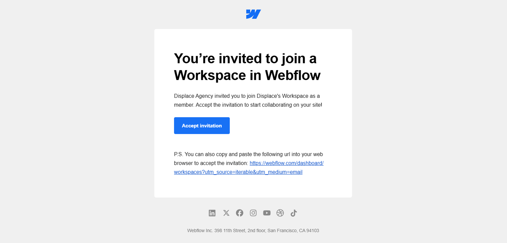

# How to Access Your Webflow Site

## What This Is & Why It Matters
Learn how to securely access your Webflow website to make updates, whether you’re logging in for the first time or helping team members join. Displace Agency built your site for easy access—here’s how it works.

## Implementation Summary

| Item | What We Cover | Status | Link |
|------|----------------|--------|------|
| [Two Ways to Access](#two-ways-to-access-your-site) | Direct login vs. Editor access | Active | — |
| [First-Time Users](#first-time-users) | Invitation, accept, password | Active | — |
| [Returning Users](#returning-users) | Fast login paths and best browsers | Active | — |
| [Troubleshooting](#troubleshooting-access-issues) | Password reset and login errors | Active | — |
| [Adding Team Members](#adding-team-members) | How Displace grants access | Active | — |
| [Security Features](#security-features) | Logout, 2FA, activity logs | Active | — |

## Two Ways to Access Your Site

### Method 1: Direct Login (For Full Access)
Use this if you need to edit content and see behind‑the‑scenes settings.

1. Go to <a href="https://webflow.com/login" target="_blank" rel="noopener noreferrer"><code>webflow.com/login</code></a>
2. Enter your email/password
3. Click “Continue”

> Note: Displace Agency will send you login credentials during onboarding.

### Method 2: Editor Access (For Simple Updates)
Use this quick method if you only need to change text, images, or blog posts.

1. Open your website (e.g., <code>yoursite.com</code>)
2. Add <code>?edit</code> to the end of the URL
3. Press Enter
4. Log in with your Displace Agency email/password

## First-Time Users

1. Check your email for “Invitation to Edit” from Displace Agency
2. Click “Accept Invitation”
3. Create a password (8+ characters, mix letters/numbers)

## Returning Users

1. Bookmark <a href="https://webflow.com/login" target="_blank" rel="noopener noreferrer"><code>webflow.com/login</code></a> or <code>yoursite.com?edit</code>
2. Enter your credentials
3. Enable “Remember Me” to skip re‑entering details next time

> Tip: Use Chrome or Safari—Webflow works best on these browsers.

## Troubleshooting Access Issues

### Forgotten Password?
1. Click “Forgot password?” on the login screen
2. Enter your Displace Agency‑registered email
3. Check your inbox for a reset link (expires in 1 hour)

### “Invalid Login” Error?
- Confirm you’re using the email Displace Agency invited
- Check for typos (Webflow logins are case‑sensitive)
- Clear browser cookies/cache

## Adding Team Members
Displace Agency can grant access to up to 3 team members:

1. Email us the person’s:
   - Full name
   - Role (e.g., “Content Editor”)
   - Company email
2. We’ll send them an invite within 24 hours
3. They follow the First‑Time Users steps above

## Security Features
Your website includes:

- Automatic logouts after 2 hours of inactivity
- Two‑factor authentication (optional—ask Displace Agency to enable)
- Activity logs tracking all changes

> Never share login details—use the collaborator invite system instead.

## Useful Links
- Webflow Login — <a href="https://webflow.com/login" target="_blank" rel="noopener noreferrer">webflow.com/login</a>
- Webflow Editor — <a href="https://university.webflow.com/lesson/editor" target="_blank" rel="noopener noreferrer">university.webflow.com/lesson/editor</a>

  <a href="./01-what-is-webflow.md" style="padding:12px 16px;border:1px solid #d0d7de;border-radius:8px;text-decoration:none;">← Previous: What is Webflow</a>
  <a href="./03-managing-content-with-the-editor.md" style="padding:12px 16px;border:1px solid #d0d7de;border-radius:8px;text-decoration:none;">Next: Managing Content with the Editor →</a>

---
Updated: August 2025 • <a href="https://github.com/displace-agency" target="_blank" rel="noopener noreferrer">Displace Agency</a>

