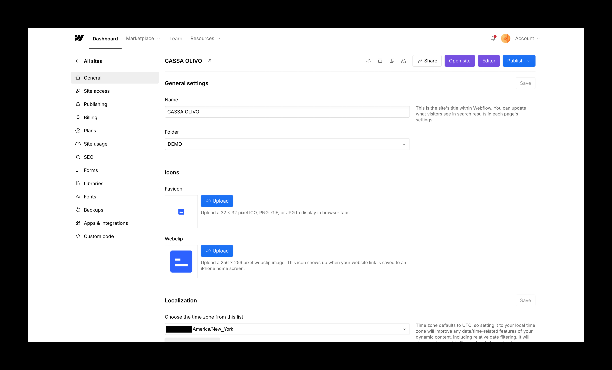

# Webflow Workspace and Project Settings

## What This Is & Why It Matters
Webflow provides two layers of configuration: your Workspace (organization level) and each Project (site level). This concise guide shows what you can do in each area, with a quick‑scan table and screenshots for orientation.

## Implementation Summary

| Item | What We Cover | Status | Link |
|------|----------------|--------|------|
| [Workspace Overview](#workspace-overview) | High‑level settings for accounts and teams | Active | — |
| [Project Overview](#project-overview) | Site‑specific settings | Active | — |

## Workspace Overview

### Quick Reference — Workspace Settings

| Item | What You Can Do |
|------|------------------|
| All Sites | View and organize all projects in the workspace |
| Client Management | Manage subscriptions paid through another account; handle client billing requests |
| Tutorials | Access Webflow’s built‑in tutorials |
| General | Name the workspace; control visibility and sharing |
| Team Management | Invite collaborators and set roles |
| Plans | Manage the workspace plan and limits |
| Billing | Manage payment methods and invoices |
| Apps | Build/install apps (advanced) |
| Libraries & Templates | Browse reusable components and starters |

> Key tip: You don’t need a workspace subscription to run a live site. A workspace plan is helpful for inviting collaborators and duplicating projects at scale.

## Project Overview

### Quick Reference — Project Settings

| Item | What You Can Do |
|------|------------------|
| General | Name project, organize in folders, set favicon/web clip, review history |
| Site Access | Invite editors/collaborators; manage roles and comments |
| Publishing & Domains | Publish to staging (.webflow.io) or production (custom domain); connect domains |
| Redirects | Create single or bulk redirects via CSV |
| Site Optimization | Toggle minify JS/CSS and related performance options |
| Billing & Transfers | Manage plan; duplicate/transfer a project (with caution) |
| Plans & Add‑Ons | Choose plan, add bandwidth, localization, experiments |
| SEO | Control indexing, robots.txt, sitemap, Search Console, canonical URL |
| Forms | Configure notifications and integrations |
| Libraries | Optional external components (use sparingly) |
| Custom Fonts | Upload and manage fonts |
| Backups | Preview and restore previous versions |
| Apps & Integrations | Set analytics pixels, API keys, and webhooks |
| Custom Code | Add head/footer code across the site |
| Project Management | Transfer, archive, duplicate, or unpublish |

### Notes & Best Practices

- Use staging for review; publish to production when approved.
- Default to www for your production domain for SEO consistency.
- After setting redirects, always re‑publish to activate changes.
- Test performance toggles before/after enabling to avoid breaking interactions.
- Keep backups before major changes; they are fast to restore.

## Useful Links
- Webflow University — <a href="https://university.webflow.com" target="_blank" rel="noopener noreferrer">university.webflow.com</a>
- Webflow Blog (Tutorials) — <a href="https://webflow.com/blog/webflow-tutorial" target="_blank" rel="noopener noreferrer">webflow.com/blog/webflow-tutorial</a>

  <a href="02-how-to-access-your-webflow-site.md" style="padding:12px 16px;border:1px solid #d0d7de;border-radius:8px;text-decoration:none;">← Previous: How to Access Your Webflow Site</a>
  

---
Updated: August 2025 • <a href="https://github.com/displace-agency" target="_blank" rel="noopener noreferrer">Displace Agency</a>
