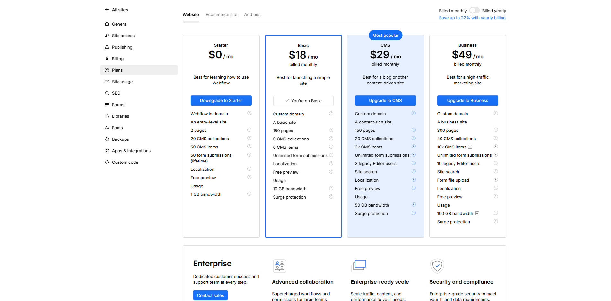
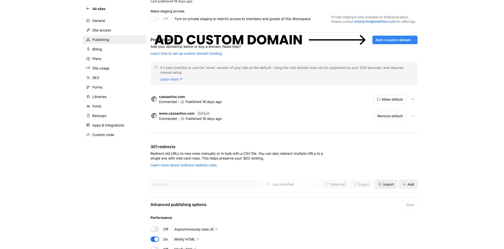
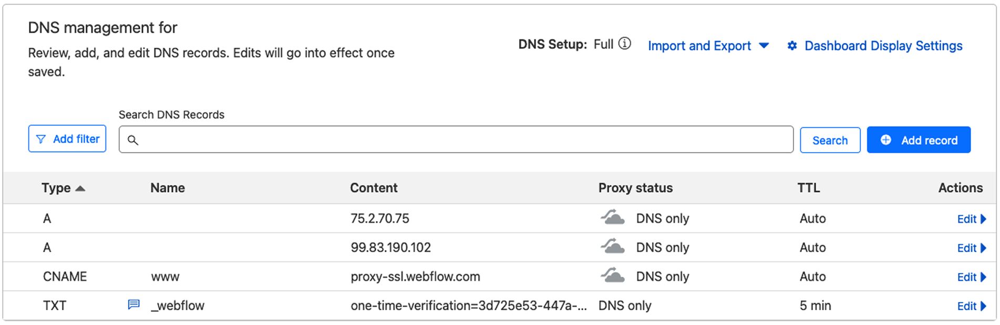
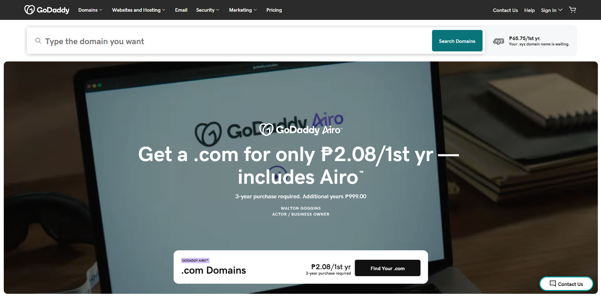
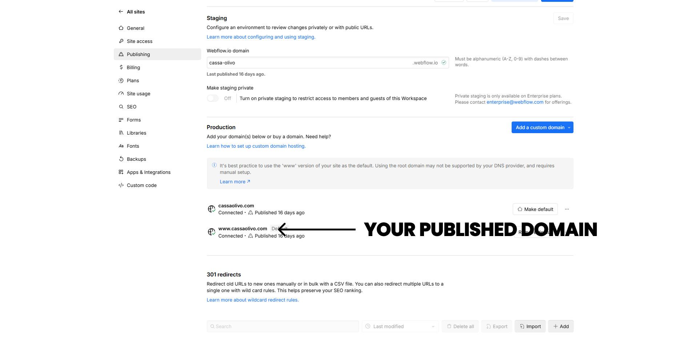
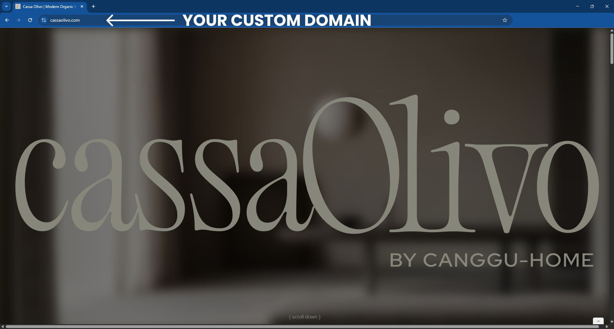

# Connect a Custom Domain in Webflow (Step‑by‑Step)

## What This Is & Why It Matters
Connecting your custom domain gives your brand a professional, memorable address. This guide explains each step clearly and safely so you can follow along or understand what Displace Agency handles on your behalf.

## Implementation Summary

| Item | What We Cover | Status | Link |
|------|----------------|--------|------|
| [What You Need Before You Start](#what-you-need-before-you-start) | What you need before starting | Active | — |
| [Step 1: Add Your Custom Domain in Webflow](#step-1-add-your-custom-domain-in-webflow) | Add root and www in Webflow | Active | — |
| [Step 2: Copy the DNS Records Provided by Webflow](#step-2-copy-the-dns-records-provided-by-webflow) | A records and CNAME from Webflow | Active | — |
| [Step 3: Update DNS Settings at Your Domain Registrar](#step-3-update-dns-settings-at-your-domain-registrar) | Add records at GoDaddy/Namecheap | Active | — |
| [Step 4: Verify and Publish](#step-4-verify-and-publish) | Check status, set default, publish | Active | — |
| [Step 5: Test Your Domain](#step-5-test-your-domain) | Confirm the site loads on custom domain | Active | — |
| [Common Issues & Troubleshooting](#common-issues-troubleshooting) | Fix common errors | Active | — |
| [Tips & Best Practices](#tips-best-practices) | Best practices for reliability | Active | — |

## What You Need Before You Start

- A purchased domain name (GoDaddy, Namecheap, Google Domains, etc.)
- A paid Webflow Site plan (required for custom domains)
- Access to your domain registrar’s DNS settings

---

## Step 1: Add Your Custom Domain in Webflow

1. Log in to Webflow and open your project.
2. Click Project Settings.
3. Open the Hosting/Publishing tab.
4. In Custom Domains, click Add Custom Domain.
5. Enter both the root domain (e.g., `yourdomain.com`) and the www domain (e.g., `www.yourdomain.com`).

---

## Step 2: Copy the DNS Records Provided by Webflow

Webflow shows the exact records your registrar needs:

- A records (root `@`):
  - 75.2.70.75
  - 99.83.190.102
- CNAME (for `www`):
  - Host: `www`
  - Value: `proxy-ssl.webflow.com`

---

## Step 3: Update DNS Settings at Your Domain Registrar

1. Sign in to your registrar (e.g., GoDaddy, Namecheap).
2. Open DNS Management / Manage DNS.
3. Remove old A or CNAME records for root `@` and `www` if they conflict.
4. Add the two A records for root `@` exactly as shown.
5. Add the CNAME for `www` pointing to `proxy-ssl.webflow.com`.

---

## Step 4: Verify and Publish

1. Back in Webflow → Hosting/Publishing, click Check Status.
2. Wait for green checkmarks; DNS can take minutes up to 48 hours.
3. Set the `www` domain as the default.
4. Click Publish to make the site live on your custom domain.

---

## Step 5: Test Your Domain

- Visit `www.yourdomain.com` in your browser.
- If it does not load yet, allow more time for propagation.

---

## Common Issues & Troubleshooting

- Domain shows “Not Secure”: Ensure SSL is enabled in Webflow Hosting.
- Site not live: Double‑check records; wait for propagation.
- “Needs Configuration”: Fix typos, remove conflicting records, then re‑check.

---

## Tips & Best Practices

- Use `www` as the default domain for broad compatibility.
- Keep registrar logins secure; share via a password manager if needed.
- Displace Agency can handle the entire setup on request.

## Useful Links
- Webflow University — <a href="https://university.webflow.com" target="_blank" rel="noopener noreferrer">university.webflow.com</a>
- Webflow Hosting — <a href="https://webflow.com/hosting" target="_blank" rel="noopener noreferrer">webflow.com/hosting</a>

  <a href="03-webflow-workspace-and-project-settings.md" style="padding:12px 16px;border:1px solid #d0d7de;border-radius:8px;text-decoration:none;">← Previous: Webflow Workspace and Project Settings</a>
  

---
Updated: August 2025 • <a href="https://github.com/displace-agency" target="_blank" rel="noopener noreferrer">Displace Agency</a>
