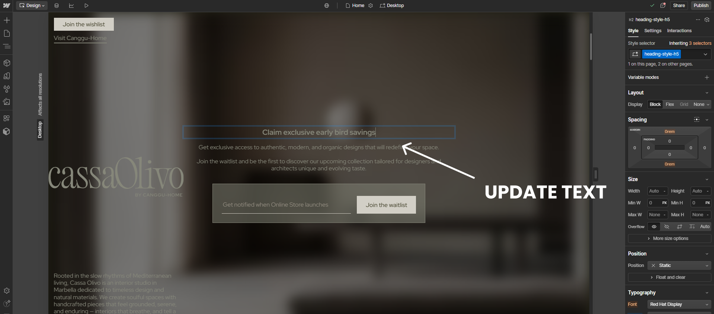
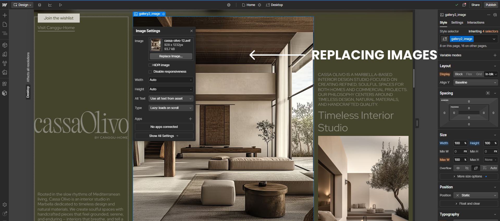
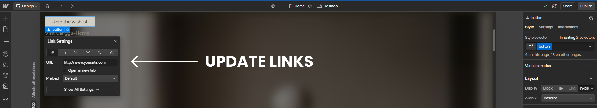
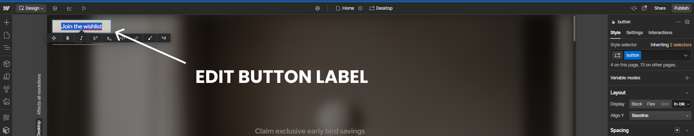
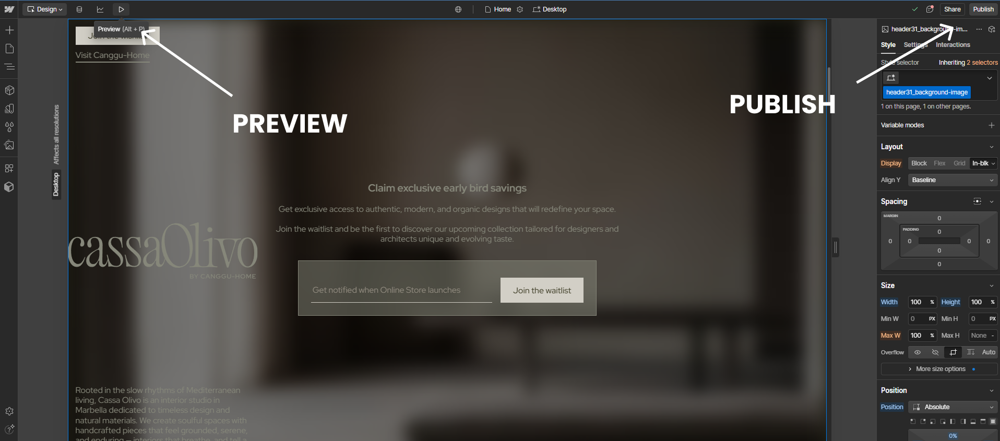
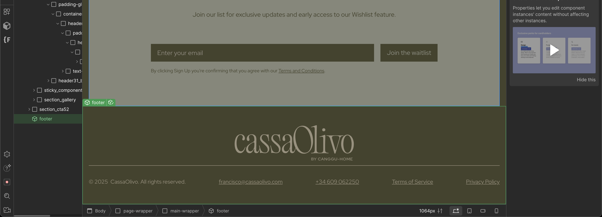
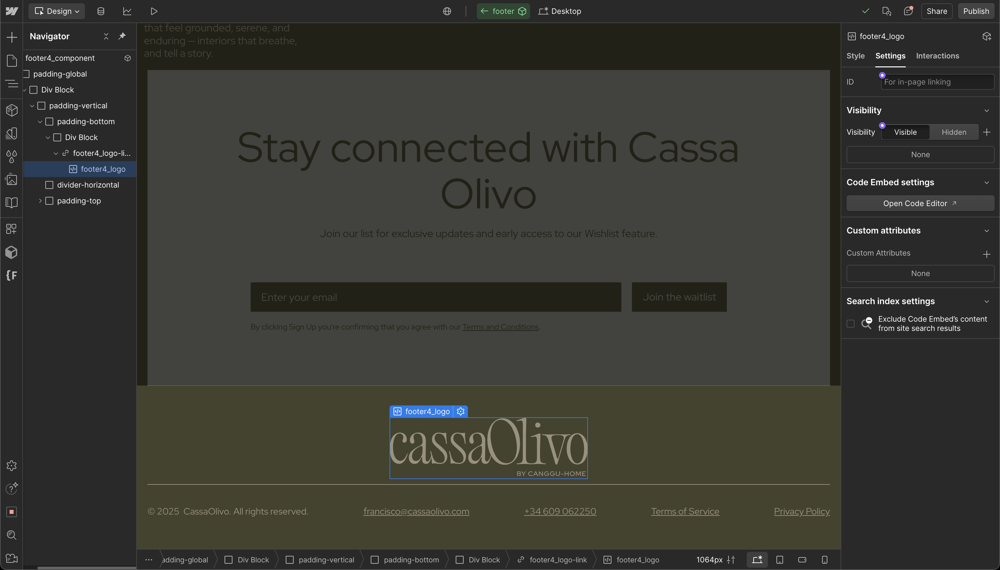

# Using the Webflow Designer (Everyday Updates + Global Components)

## What This Is & Why It Matters
This guide shows you how to make everyday updates in the Webflow Designer: change text, swap images, update links and buttons, and safely edit global components like the navigation and footer. Displace Agency configured your site so common updates are straightforward while preserving design integrity.

## Implementation Summary

| Item | What We Cover | Status | Link |
|------|----------------|--------|------|
| [What You Can Update in the Webflow Designer](#what-you-can-update-in-the-webflow-designer) | Text, images, links, buttons | Active | — |
| [Step-by-Step: Updating Text](#step-by-step-updating-text) | Edit copy inline and save | Active | — |
| [Step-by-Step: Replacing Images](#step-by-step-replacing-images) | Swap images via asset picker | Active | — |
| [Step-by-Step: Updating Links](#step-by-step-updating-links) | Change URLs on links and buttons | Active | — |
| [Step-by-Step: Editing Buttons](#step-by-step-editing-buttons) | Update labels and destinations | Active | — |
| [Preview and Publish](#preview-and-publish) | Verify changes, then publish | Active | — |
| [Editing Global Components (Navigation, Footer)](#editing-global-components-navigation-footer) | Open, edit, and update site‑wide components | Active | — |
| [Tips for Smooth Updates](#tips-for-smooth-updates) | Safer, faster editing habits | Active | — |

---

## What You Can Update in the Webflow Designer

With the Webflow Designer, you can:

- Change text anywhere on your site
- Replace images and logos
- Update links (including buttons and menus)
- Edit button labels and destinations

---

## Step-by-Step: Updating Text

1. Open your project in the Designer
2. Select the text (heading, paragraph, caption)
3. Type your new content
4. Click outside the element to apply

---

## Step-by-Step: Replacing Images

1. Select the image
2. Click Replace Image
3. Upload a new image or pick from Assets
4. Confirm replacement

---

## Step-by-Step: Updating Links

1. Select the link or button
2. Open link settings
3. Enter a new URL or pick an internal page
4. Save

---

## Step-by-Step: Editing Buttons

1. Click the button component
2. Update the label text
3. Set the link destination
4. Save

---

## Preview and Publish

1. Click Preview to review changes as a visitor
2. Exit Preview
3. Click Publish to push changes live

---

## Editing Global Components (Navigation, Footer)

Global components (like the navigation bar and footer) update across every page.

1. In the Designer, open or locate the global component
2. Click to open the component for editing
3. Make changes (text, links, icons)
4. Save and publish; updates apply site‑wide

---

## Tips for Smooth Updates

- Preview before publishing
- Save frequently and keep changes small
- If you’re unsure about a design change, ask Displace Agency before publishing

## Useful Links
- Webflow University — <a href="https://university.webflow.com" target="_blank" rel="noopener noreferrer">university.webflow.com</a>

  <a href="04-domain-configuration.md" style="padding:12px 16px;border:1px solid #d0d7de;border-radius:8px;text-decoration:none;">← Previous: Connect a Custom Domain in Webflow (Step‑by‑Step)</a>
  

---
Updated: August 2025 • <a href="https://github.com/displace-agency" target="_blank" rel="noopener noreferrer">Displace Agency</a>
