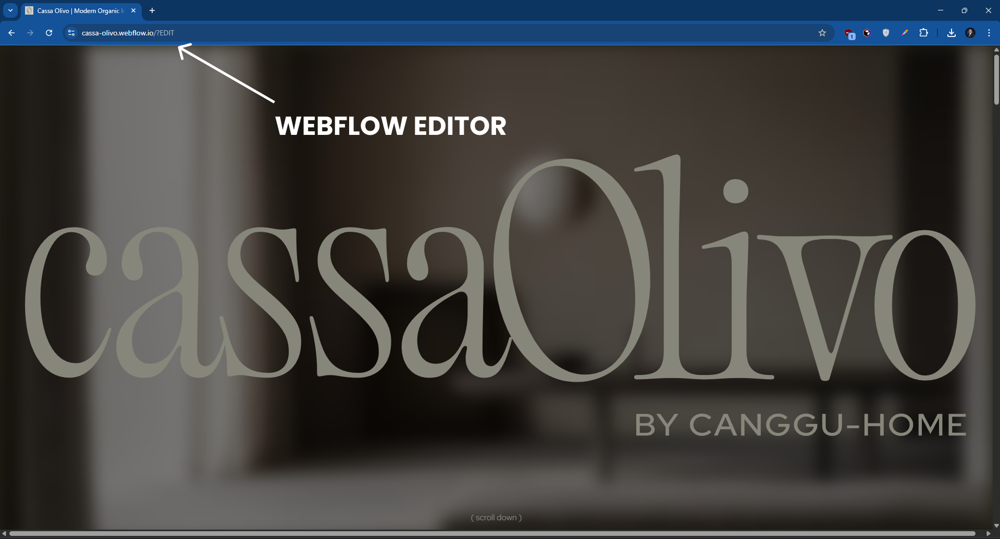
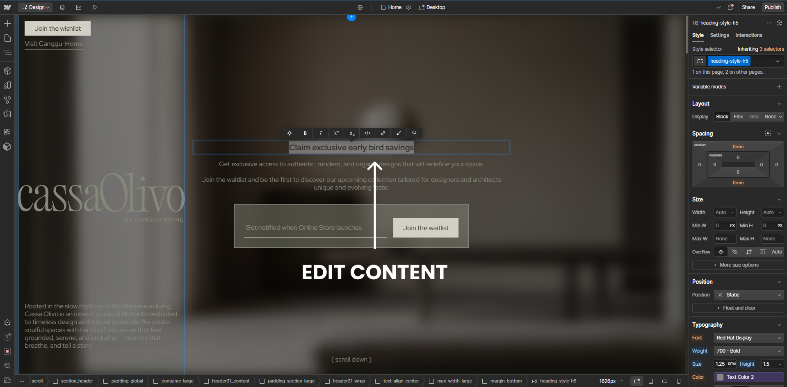

# What is Webflow and How Does It Work?

## What This Is & Why It Matters
Webflow is a visual website builder that lets Displace Agency design and ship custom, professional sites without writing code. We design visually; Webflow generates clean HTML/CSS/JS. Clients get an easy way to edit content without breaking layouts.

## Article Summary

| Section | What You'll Learn | Link |
|--------|--------------------|------|
| Webflow Made Simple | The core idea and why it fits our workflow | [Jump](#webflow-made-simple) |
| Key Features | The must‑know capabilities for teams | [Jump](#key-features) |
| Webflow Designer | How we build structure, style, and animations | [Jump](#webflow-designer) |
| Webflow Editor | How you edit content safely after launch | [Jump](#webflow-editor) |
| Webflow Hosting | What’s included out of the box | [Jump](#webflow-hosting) |
| Why Displace Agency Chooses Webflow | Design control, client UX, performance | [Jump](#why-displace-agency-chooses-webflow) |
| Getting Started | Log in, edit, and publish with confidence | [Jump](#getting-started-with-your-webflow-site) |

## Webflow Made Simple
**Webflow combines professional design freedom with client‑friendly content editing.** We build unique experiences that match your brand precisely. You can edit text, swap images, and publish changes in minutes.

## Key Features
- No coding required to create production‑ready sites
- Built‑in, globally distributed hosting (CDN)
- Responsive design and mobile‑first tooling
- Visual animations and interactions
- On‑page editing for content teams

## Webflow Designer (for Displace Agency)
Where we build your site’s structure, style, and interactions.

- Semantic layout with CSS grid/flex
- Component‑based design system
- Animation timeline and scroll interactions

## Webflow Editor (for You)
Your on‑page, safe‑to‑use content editing dashboard.

- Edit text and swap images inline
- Create and publish CMS content (e.g., blog posts)
- Track changes before publishing

How to access:
1. Visit `https://your-site.com/?edit`
2. Log in with your Displace Agency credentials

## Webflow Hosting
Fast, secure, and managed hosting included.

- Free SSL certificates
- Automatic backups and versioning
- Global CDN for speed and reliability

## Why Displace Agency Chooses Webflow
### 1) Total Design Control
We create custom layouts, advanced interactions, and pixel‑perfect brand systems—without template constraints.

### 2) Client‑Friendly Updates
Teams can update bios, pricing, promotions, and content safely. The visual editor prevents breaking the design.

### 3) Better Performance
Webflow’s optimized delivery typically results in faster loads vs. generic CMS stacks, improving rankings and UX.

## Getting Started With Your Webflow Site
### Step 1: Log In
1. Look for Displace Agency’s invitation email
2. Click “Accept Invitation”
3. Bookmark `https://your-site.com/?edit`

### Step 2: Edit Content
- Click any text or image to edit
- Use the sidebar to upload files
- Save frequently

### Step 3: Publish Safely
1. Click “Preview” to review changes
2. Select “Publish to Live Site”
3. Confirm in the pop‑up

## Useful Links
- Webflow University: Getting Started — <a href="https://university.webflow.com" target="_blank" rel="noopener noreferrer">university.webflow.com</a>
- Webflow Editor — <a href="https://university.webflow.com/lesson/editor" target="_blank" rel="noopener noreferrer">university.webflow.com/lesson/editor</a>
- Webflow Hosting — <a href="https://webflow.com/hosting" target="_blank" rel="noopener noreferrer">webflow.com/hosting</a>

---
Category: Webflow  
Tags: #Webflow #NoCode #CMS #Hosting  
Last Updated: August 2025  
Article Version: 1.0

